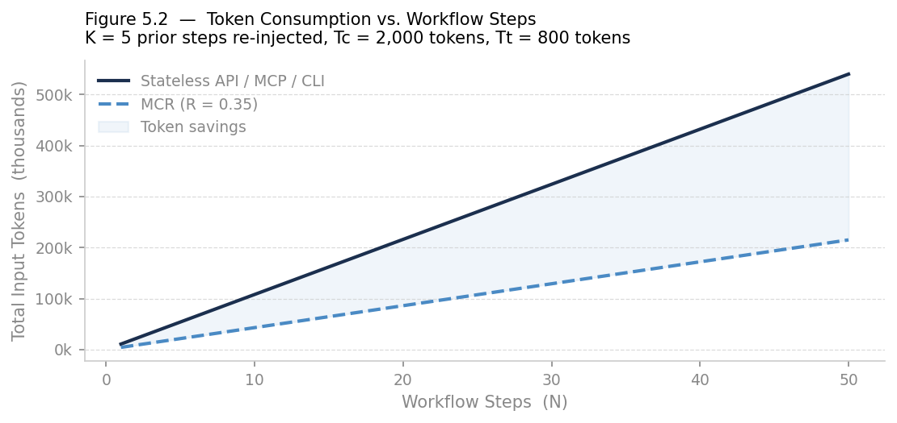
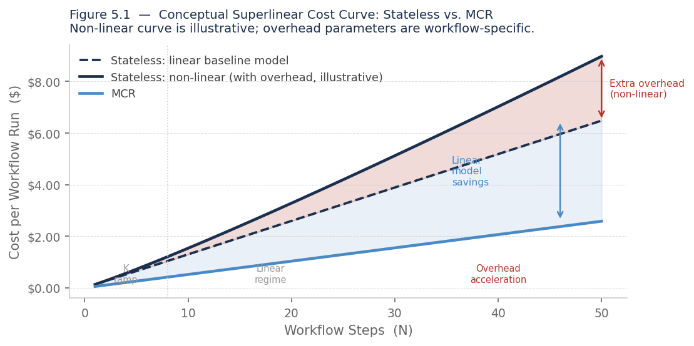
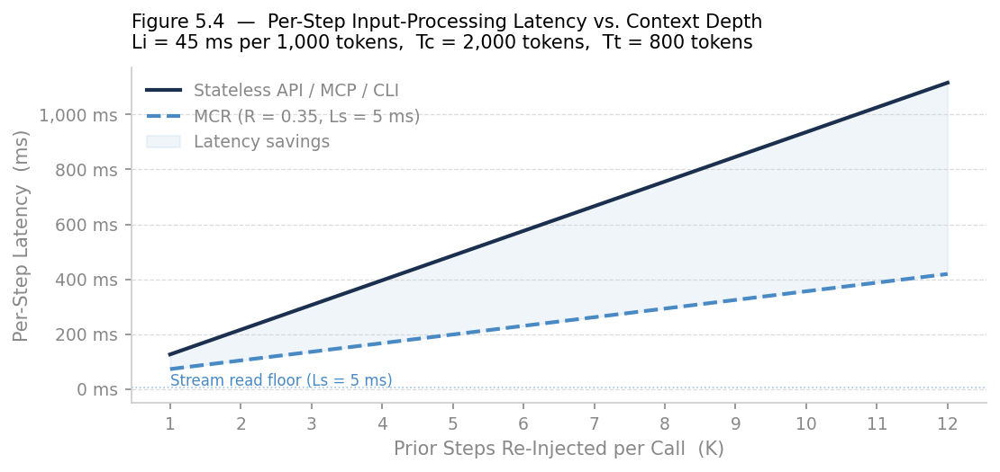
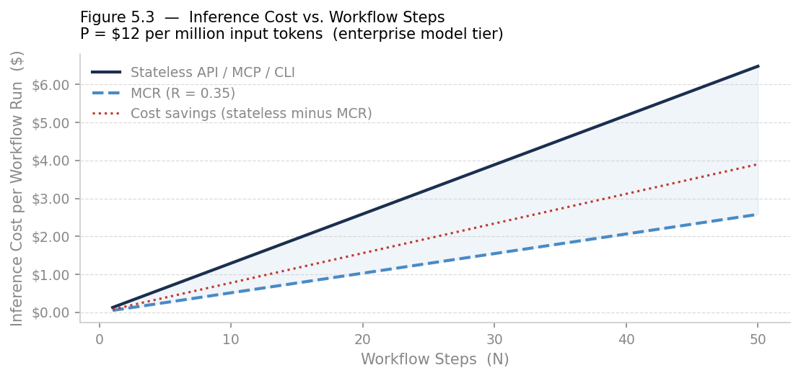
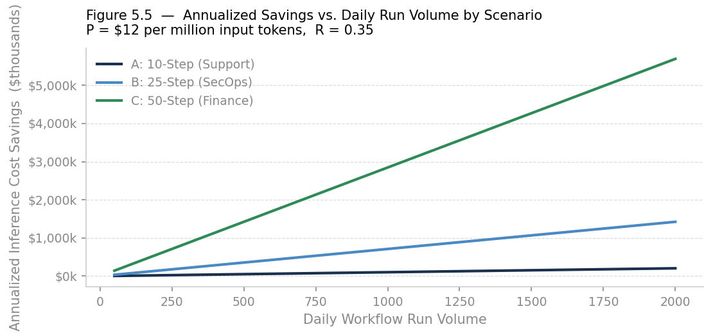

# Model Context Routing

**Externalizing Attention into a Persistent, Event-Driven Context Plane**

*Shane D. Shook, PhD*  
*April 18, 2026*

An architectural pattern for persistent, event-driven AI context management implemented on Synadia's NATS and JetStream infrastructure. MCR eliminates stateless context loss in multi-step enterprise AI workflows, providing measurable reductions in token consumption, inference cost, and latency while enabling deterministic service-level guarantees.

## Executive Summary

Large language models deployed in enterprise workflows fail not because of reasoning limitations but because of a structural mismatch in how they are invoked. Each model invocation is stateless. Context is reconstructed from scratch at every step. Instructions are repeated, prior decisions are re-established, and prior outputs must be re-injected, creating a compounding cycle of token waste, latency, and outcome variability.

This paper introduces Model Context Routing (MCR), a system-level architectural pattern that separates context management from model execution. Rather than relying on the model's context window to carry state across workflow steps, MCR externalizes state into a durable, event-driven infrastructure layer built on NATS messaging and JetStream persistence, governed by the Synadia control plane.

MCR is not a product. It is an architectural abstraction: a defined pattern for how enterprise systems should publish, persist, correlate, and selectively retrieve AI context across multi-step workflows. It is complementary to existing standards including Anthropic's Model Context Protocol (MCP), REST APIs, and CLI-based agent orchestration, all of which serve as ingress points that publish into the MCR context plane.

Section 5 presents a quantitative estimation framework demonstrating that MCR reduces per-workflow input token consumption by 30 to 65 percent under a relevance ratio of 0.35, depending on workflow depth and context density. For the three representative enterprise scenarios modeled in Section 5.5, reductions range from 55 to 62 percent. Combined with Synadia's SLA enforcement and deterministic context reconstruction, MCR provides a foundation for enterprise AI deployments where cost, latency, and output consistency can be governed by policy rather than accepted as inherent variability.

## 1. The Context Persistence Problem in Enterprise AI

### 1.1 The Two Levels of Context Loss

Context loss in deployed AI systems manifests at two distinct architectural levels, each requiring a different remediation strategy. Understanding both is essential for diagnosing the performance degradation that enterprise operators observe in production workflows.

**Level 1: Intra-Model Signal Dilution**

Recent architecture research from the Kimi/Moonshot AI team introduces Attention Residuals as a solution to a fundamental flaw in standard transformer residual connections. The paper identifies what it calls PreNorm dilution: in standard transformer architectures, residual connections aggregate all preceding layer outputs using fixed, uniform unit weights. Every layer therefore receives the same undifferentiated accumulation of all prior layer representations, with no mechanism to selectively emphasize or suppress individual layer contributions.

The consequence is that as network depth increases, hidden-state magnitude grows without bound, progressively attenuating each layer's individual contribution. Earlier layer signals, which often encode foundational semantic content, are diluted by the accumulation of later representations. The Attention Residuals paper proposes replacing this fixed accumulation with learned, input-dependent softmax attention over preceding layer outputs, allowing each layer to selectively weight which prior representations it draws from.

This confirms a structural tendency within transformer models toward progressive signal weakening over depth, a tendency that is independent of sequence length or context window size. Even within a single well-formed prompt, the internal representation of earlier content is subject to dilution relative to more recent content.

**Level 2: Inter-Call Statelessness in Enterprise Workflows**

Distinct from intra-model dilution, and compounded by it, is the operational problem of statelessness across separate model invocations. Enterprise workflows do not consist of single model calls. They consist of sequences of calls across multiple steps, systems, agents, and time intervals. Each API invocation to an LLM endpoint is stateless by design: no prior call's results, decisions, or established context persist into the next call unless the calling system explicitly re-injects them.

This creates what might be called the context reconstruction tax: the token overhead incurred by re-establishing workflow state at every step. In a ten-step workflow where each step requires context from three prior steps, token consumption and latency scale non-linearly. In a thirty-step workflow spanning multiple days, as is common in enterprise finance, security operations, and software delivery, the reconstruction tax becomes economically material.

The two levels interact. Because the model's internal attention tends to dilute earlier representations even within a single call, re-injected context is less reliably processed than context present at the start of the original call. Multi-step enterprise workflows are therefore subject to both architectural signal loss and operational context loss simultaneously.

The Attention Residuals research validates that selective, learned aggregation over prior representations outperforms uniform accumulation, even within a single forward pass. MCR applies this same principle at the infrastructure level: rather than re-injecting all prior context uniformly, MCR selectively reconstructs only the workflow state relevant to the current invocation.

### 1.2 Observed Failure Modes in Production Deployments

The combined effect of these two levels of context loss produces identifiable and recurring failure modes in enterprise AI deployments:

- **Instruction drift.** Multi-step workflows exhibit progressive deviation from original task specifications as the model deprioritizes earlier instructions in favor of more recent context. Operators compensate by repeating system instructions at each step, a direct token cost with diminishing returns.

- **Decision inconsistency.** Identical decision logic applied at different points in a workflow produces different outputs because the reconstructed context differs across invocations. This makes service-level enforcement for AI-driven processes extremely difficult.

- **Context overflow.** Long-running workflows eventually exceed practical context window limits. When truncation occurs it is typically not governed by relevance; the most recently injected content is retained, which is not necessarily the most important.

- **Latency cascades.** Each context reconstruction step introduces latency. In workflows where prior outputs are large, such as multi-document analysis, extended reasoning chains, or multi-agent outputs, re-injection can dominate inference latency.

- **Auditability gaps.** Because context is ephemeral, constructed and discarded per invocation, there is no durable record of what information the model had access to at each decision point. This creates compliance and audit exposure for regulated industries.

## 2. Model Context Routing: Architecture and Principles

### 2.1 Defining Model Context Routing

Model Context Routing (MCR) is a system-level architectural pattern that separates context management from model execution. It introduces a persistent, event-driven context plane positioned between the systems that initiate AI requests and the model providers that fulfill them. MCR does not modify how models work internally. It governs how context flows into, through, and out of model invocations at the infrastructure level.

The core principle of MCR mirrors the insight of the Attention Residuals research: selective, learned aggregation over prior representations outperforms uniform, undifferentiated accumulation. Where AttnRes implements this principle within a transformer's depth dimension, MCR implements it within the workflow's temporal dimension. At each workflow step, MCR reconstructs only the context elements relevant to the current task, not the entire prior history indiscriminately.

### 2.2 Relationship to MCP and Existing Protocols

MCR does not replace or compete with Anthropic's Model Context Protocol (MCP), REST API integrations, or CLI-based agent orchestration. These protocols define how a model receives context and returns a response within a single invocation. MCR operates at the workflow orchestration layer, defining how context is accumulated, persisted, and selectively delivered across multiple invocations over the lifetime of a workflow.

In an MCR-governed architecture, MCP endpoints, REST APIs, and CLI tools function as ingress mechanisms. They publish their requests and responses as events into the MCR context plane. MCR then governs persistence, correlation, and selective reconstruction. The model itself is unaware of MCR; it receives a well-formed context window assembled from the persisted event stream, identical in structure to any other caller-supplied context.

- **MCP / REST API / CLI.** Protocol for a single model invocation: what context is provided, how tools are called, and how the model responds.

- **MCR.** Infrastructure pattern for context persistence and selective reconstruction across multiple invocations throughout the lifetime of a workflow.

- **Interaction model.** MCP, API, and CLI interfaces act as ingress points that publish events into the MCR context plane. They are unmodified; MCR wraps around them at the infrastructure layer.

### 2.3 Architectural Components

MCR's context plane consists of four functional layers, each with a distinct responsibility.

**Ingress Normalization**

Events from heterogeneous sources, including MCP endpoints, REST API calls, CLI invocations, agent outputs, and webhook triggers, are normalized into a consistent event schema and published to NATS subjects organized by domain, workflow type, and tenant. This normalization ensures that downstream context reconstruction is deterministic regardless of the original event source.

**Context Persistence**

Published events are persisted in JetStream streams configured with appropriate retention, replay, and delivery semantics. Each event is tagged with a correlation identifier that links it to its parent workflow instance. JetStream provides exactly-once delivery semantics, configurable retention policies, and consumer acknowledgment, all prerequisites for reliable context management in enterprise workflows.

**Context Reconstruction**

When a new workflow step is initiated, MCR services subscribe to the relevant stream, filter by correlation identifier, and reconstruct the workflow state relevant to the current task. Reconstruction is governed by retrieval policies configured to include recency-weighted context, role-filtered context (for example, only prior model outputs rather than system events), or domain-specific context defined at workflow design time.

**Routing and Dispatch**

The reconstructed context, combined with the new task request, is used to select and dispatch to the appropriate model provider. Routing decisions are governed by SLA requirements, cost constraints, compliance policies, and current load conditions. The model receives a well-formed context window. Its response is captured and re-published as a new event into the context plane, completing the cycle.

## 3. Infrastructure: NATS, JetStream, and the Synadia Control Plane

### 3.1 Why NATS for the Context Plane

NATS is a lightweight, high-performance, cloud-native messaging system designed for distributed systems at scale. Its subject-based publish-subscribe model, sub-millisecond message delivery, and native support for multi-tenancy and geographic distribution make it well-suited as the transport layer for MCR's context plane.

- **Subject taxonomy.** NATS subjects are hierarchical and support wildcard subscription, enabling fine-grained routing of context events by domain, tenant, workflow type, and priority without requiring additional routing infrastructure.

- **Decoupled producers and consumers.** Context producers (ingress adapters) and consumers (context reconstruction services) are fully decoupled, enabling independent scaling and failure isolation.

- **Native multi-tenancy.** NATS accounts provide cryptographically enforced tenant isolation at the messaging layer, a prerequisite for enterprise deployments where multiple business units or customers share infrastructure.

- **Global distribution.** NATS supports multi-cluster topologies with geographic distribution, enabling context persistence to colocate with model endpoints and comply with data residency requirements.

### 3.2 JetStream Persistence Semantics for Context Management

JetStream extends core NATS with durable persistence, consumer acknowledgment, and stream management capabilities essential to MCR's context plane.

**Stream Configuration**

JetStream streams are configured per workflow domain with retention policies matched to business requirements. Time-based retention ensures context is available for the duration of long-running processes. Size-based retention provides cost control. Interest-based retention, which retains messages only while active consumers exist, is appropriate for ephemeral workflow types.

**Consumer Groups and Correlation**

JetStream consumers are configured to filter by subject and, through message headers, by correlation identifier. This allows MCR reconstruction services to retrieve only the events belonging to a specific workflow instance without scanning entire streams. Consumer acknowledgment policies ensure that reconstruction operations are idempotent and can be resumed on failure.

## 4. Service Level Improvements

### 4.1 Deterministic Context Reconstruction

A fundamental service level challenge in stateless AI architectures is outcome variability: the same workflow, executed twice with nominally the same inputs, may produce different results because the context reconstruction process at each step introduces variation. Token ordering, truncation decisions, and prompt formatting differences all contribute to non-determinism that makes service-level enforcement effectively impossible.

MCR addresses this by making context reconstruction a deterministic, reproducible operation. The JetStream event stream for a given workflow instance contains an ordered, immutable record of all events. The reconstruction service applies the same retrieval policy to produce the same context for the same workflow state, eliminating reconstruction-induced variability.

### 4.2 Backpressure and Flow Control

JetStream's persistence layer provides natural backpressure handling for MCR deployments. When downstream model endpoints are under load, context events accumulate in JetStream streams rather than being dropped or causing upstream timeouts. Consumer acknowledgment ensures that no context events are lost, and the decoupling of context production from context consumption enables MCR architectures to gracefully absorb load spikes that would cause cascading failures in synchronous, stateless architectures.

### 4.3 Latency Control Through Routing Policies

MCR's routing layer enables latency to be managed as a first-class service level objective. Rather than accepting the latency of a single fixed model endpoint, MCR routing policies specify latency budgets for each workflow step and route to the fastest available provider meeting the task's quality requirements. When a primary provider is experiencing elevated latency, routing policies fail over to an alternative provider without workflow-level reconfiguration.

### 4.4 Replay-Based Validation and Compliance

For regulated industries, MCR's replay capability provides a compliance posture that is impossible to achieve in stateless architectures. Every context event, meaning the exact information the model had access to at each decision point, is retained in JetStream with configurable retention periods. Compliance processes can replay any workflow instance to validate that the model's reasoning was consistent with the available context, or to investigate anomalous outputs after the fact.

This is particularly valuable in financial services, where model-assisted credit and risk decisions are subject to regulatory scrutiny; in healthcare, where clinical decision support outputs must be explainable; and in security operations, where incident response decisions may be reviewed weeks or months after resolution.

## 5. Cost Estimation Framework: MCR versus Stateless API / MCP / CLI

This section presents a quantitative estimation model for comparing the resource costs of stateless invocation patterns against MCR-governed workflows. The model is parameterized to allow projection across different workflow profiles and can be calibrated to an organization's actual token consumption and pricing data.

Before presenting the quantitative model, it is important to establish its scope. The formulas in sections 5.3 through 5.6 are linear estimations. They accurately capture the baseline context reconstruction tax but do not capture several compounding mechanisms that cause actual stateless costs to grow faster than linearly with workflow length. Section 5.1 describes those mechanisms. The linear model is therefore a lower bound on actual stateless costs, and the savings percentages derived from it are conservative estimates of true MCR value.

### 5.1 Why Real-World Stateless Costs Are Superlinear

The linear model treats token consumption per step as a constant: K prior steps, each of Tc tokens, plus Tt task tokens, repeated N times. In practice, four interacting mechanisms cause actual costs to curve upward as workflows grow, compounding the economic case for MCR.

**Compensation Token Drift**

As a stateless workflow extends, operators and automated orchestration layers observe declining output consistency and respond by adding compensating tokens: explicit re-statements of system instructions, intermediate summaries, and state recaps injected alongside the prior context. This causes the effective per-step token count to grow beyond the baseline K times Tc. The growth profile is approximately logarithmic with step index, since each additional instruction re-statement adds a fixed marginal volume while the need for re-statement grows with workflow length. Even a modest drift rate of 10 to 15 percent additional tokens per logarithmic decade of workflow steps causes cumulative costs to exceed the linear model by 25 to 40 percent at N equals 50.

**Congestion-Driven Model Routing Degradation**

Model routers operating under load preferentially assign requests to available capacity, which is disproportionately found in smaller, less expensive models with more limited context windows. A workflow that begins execution on a large-context primary model may be partially re-routed to fallback models with context windows of 8,000 to 16,000 tokens as system load increases. These narrower windows compress the effective context limit dynamically, causing overflow to occur at lower accumulated context depths than the nominal model tier would suggest. The result is that context overflow, truncation, and associated re-run costs become likely at workflow lengths that appear safe under the nominal specification.

**Re-Iteration Overhead from Quality Degradation**

When context is truncated or attention is diluted over a long prompt, output quality at affected steps degrades measurably. Automated validation checks and human review cycles detect this degradation and trigger re-execution of the affected step, each re-execution carrying the full context reconstruction cost of the original. If the re-run probability at step i is denoted rho(i) and rho(i) is non-trivial (even 10 to 15 percent for steps operating near context window limits), the effective cost multiplier for that step is 1 divided by (1 minus rho(i)). Across N steps in this condition, the cumulative re-iteration overhead is superlinear.

**Interaction and Compounding**

These mechanisms do not operate independently. Higher compensation token drift pushes per-step token counts toward context window limits sooner, increasing the probability of congestion-driven routing to smaller models, which further compresses effective context windows, which increases re-run rates, which adds more re-iteration tokens, which further increases drift. The feedback loop means that the three mechanisms compound multiplicatively, not additively, in sufficiently long workflows.

**What This Means for the Quantitative Model**

The values of the overhead parameters (compensation drift rate, routing degradation threshold, re-run coefficient) are workflow-specific and cannot be generalized without instrumented production data. For this reason, the quantitative model in sections 5.3 through 5.6 isolates only the linear component. The specific cost projections in Section 5.6 should be read as conservative lower bounds. For workflows with N greater than approximately 20 steps, actual stateless costs may exceed the linear model by 20 to 40 percent, while MCR costs remain approximately linear throughout because MCR is structurally insulated from all three mechanisms.

MCR's structural insulation: context delivered to the model is always bounded by the retrieval policy (R times K times Tc plus Tt), which stays well within any model's context window regardless of workflow length. Compensation drift does not occur because the prior context is precisely reconstructed, not re-stated. Congestion-driven routing degradation does not affect MCR token counts because the token budget per step is policy-controlled. Re-run rates from context loss are near zero. The MCR cost curve remains approximately linear as N grows, while stateless costs accelerate; the savings ratio widens with workflow length.



*Figure 5.1. Conceptual superlinear cost curve. The dashed line shows the linear model used in Section 5.6; the solid upper curve shows a representative non-linear cost profile with compensation drift (α = 0.12), soft context window overflow (W = 12,000 tokens), and re-run overhead (coefficient = 0.20). The shaded red region between the two stateless curves represents savings that the linear model does not capture. Non-linear parameters are illustrative; actual values are workflow-specific.*

### 5.2 Model Variables and Definitions

The following variables define the cost estimation model:

| Variable | Definition |
|----------|------------|
| N | Total number of steps in a workflow instance |
| K | Average number of prior steps re-injected per invocation in a stateless architecture |
| R | Relevance ratio (0 to 1): the fraction of prior context that MCR injects via selective reconstruction. A value of 0.35 means MCR injects 35 percent of what a stateless call would inject. |
| Tc | Average token count per prior-step context chunk |
| Tt | Average token count of the new task request at each step |
| P | Model input pricing in dollars per 1,000 tokens |
| Li | Model input processing latency in milliseconds per 1,000 tokens |
| Ls | JetStream stream read latency per reconstruction in milliseconds (typically 2 to 8 ms) |

### 5.3 Token Consumption Model

For a stateless architecture, total input tokens consumed by a workflow instance are:

```
Tokens(stateless) = N × (K × Tc + Tt)
```

The first term, N × K × Tc, is the context reconstruction tax: tokens consumed purely to re-establish prior state at each step. For MCR, selective reconstruction replaces full re-injection:

```
Tokens(MCR) = N × (R × K × Tc + Tt)
```

Token savings per workflow instance and as a percentage of total stateless consumption:

```
Savings(tokens) = N × (1 - R) × K × Tc
Savings(%)      = (1 - R) × K × Tc / (K × Tc + Tt)
```

With R = 0.35, the savings percentage ceiling is (1 - R) = 65 percent, approached only when K × Tc greatly exceeds Tt. For shallow workflows with K = 1 the formula yields approximately 30 to 35 percent savings. For the enterprise workflow profiles in Section 5.5 (K = 3 to 8), the modeled range is 55 to 62 percent. Tighter retrieval policies, that is, lower R values, raise the ceiling proportionally.



*Figure 5.3. Token consumption versus workflow steps. Parameters: K = 5, Tc = 2,000, Tt = 800, R = 0.35. The shaded region represents tokens eliminated by MCR's selective reconstruction.*

### 5.4 Cost Model

Translating token savings to dollar cost, with P expressed as dollars per 1,000 tokens:

```
Cost(stateless) = N × (K × Tc + Tt) × P / 1,000
Cost(MCR)       = N × (R × K × Tc + Tt) × P / 1,000  +  MCR_overhead
```

MCR overhead consists of NATS messaging and JetStream storage costs, which are negligible compared to model inference costs at enterprise scale. At Synadia's published pricing, per-message costs are on the order of fractions of a cent per thousand messages, compared to dollars per million tokens for capable model tiers.



*Figure 5.4. Inference cost versus workflow steps, with cost savings shown as a separate line. P = $12 per million input tokens. Parameters as in Figure 5.3.*

### 5.5 Latency Model

Per-step end-to-end input-processing latency for stateless invocation and for MCR:

```
Latency(stateless, step) = (K × Tc + Tt) × Li / 1,000
Latency(MCR, step)       = Ls + (R × K × Tc + Tt) × Li / 1,000
```

For high-K workflows the JetStream read latency Ls is negligible compared to the inference latency saved by reducing input token count. As context depth K increases, the gap between stateless and MCR latency widens. With R = 0.35, Tc = 2,000, Tt = 800, Li = 45, and Ls = 5, the stateless-to-MCR latency ratio at K = 10 is 936 ms divided by 356 ms, or approximately 2.6 times. The ratio asymptotes toward 1/R = 2.86 as K grows large and task tokens become proportionally smaller relative to re-injected context.



*Figure 5.5. Per-step input-processing latency versus context depth K. Li = 45 ms per 1,000 tokens, Tc = 2,000, Tt = 800, Ls = 5 ms, R = 0.35. At K = 10 the stateless-to-MCR ratio is 2.63; the ratio asymptotes toward 1/R = 2.86 as K grows large.*

### 5.6 Scenario Projections

The following scenarios apply the model with representative parameters. Model input pricing is $12 per million tokens at an enterprise volume rate. Li = 45 ms per 1,000 tokens. R = 0.35 for all scenarios.

**Scenario A: Lightweight Workflow (Customer Support, 10 Steps)**

| Metric | Value |
|--------|-------|
| Parameters | N = 10, K = 3, Tc = 1,200 tokens, Tt = 600 tokens |
| Stateless tokens | 10 × (3 × 1,200 + 600) = 42,000 tokens per run |
| MCR tokens | 10 × (0.35 × 3 × 1,200 + 600) = 18,600 tokens per run |
| Token reduction | 55.7 percent |
| Cost per run (stateless / MCR) | $0.504 / $0.223 |
| Annualized savings at 2,000 runs per day | approximately $205,000 |
| Per-step latency (stateless / MCR) | 189 ms / 88.7 ms |

**Scenario B: Mid-Complexity Workflow (Security Operations Incident, 25 Steps)**

| Metric | Value |
|--------|-------|
| Parameters | N = 25, K = 5, Tc = 2,000 tokens, Tt = 800 tokens |
| Stateless tokens | 25 × (5 × 2,000 + 800) = 270,000 tokens per run |
| MCR tokens | 25 × (0.35 × 5 × 2,000 + 800) = 107,500 tokens per run |
| Token reduction | 60.2 percent |
| Cost per run (stateless / MCR) | $3.24 / $1.29 |
| Annualized savings at 500 runs per day | approximately $355,000 |
| Per-step latency (stateless / MCR) | 486 ms / 198.5 ms |

**Scenario C: High-Complexity Workflow (Financial Credit Decision, 50 Steps)**

| Metric | Value |
|--------|-------|
| Parameters | N = 50, K = 8, Tc = 2,500 tokens, Tt = 1,000 tokens |
| Stateless tokens | 50 × (8 × 2,500 + 1,000) = 1,050,000 tokens per run |
| MCR tokens | 50 × (0.35 × 8 × 2,500 + 1,000) = 400,000 tokens per run |
| Token reduction | 61.9 percent |
| Cost per run (stateless / MCR) | $12.60 / $4.80 |
| Annualized savings at 200 runs per day | approximately $569,000 |
| Per-step latency (stateless / MCR) | 945 ms / 365 ms |

These projections assume a fixed relevance ratio of 0.35. Actual ratios depend on retrieval policy design and workflow structure. Organizations should baseline their own K, Tc, and Tt values from production API logs before applying this model.



*Figure 5.6. Annualized inference cost savings versus daily run volume for all three scenarios. Savings scale linearly with volume; the slope of each line reflects per-run savings for that scenario.*

### 5.7 SLA Value: From Variable to Bounded Latency

The cost model above captures the average-case benefit of MCR. The SLA benefit is captured in variance reduction, which averages do not fully represent. In stateless architectures, per-step latency variance is driven by context reconstruction size variability: different steps in the same workflow inject different amounts of prior context depending on what is available. This produces wide latency distributions that make p95 and p99 commitments very difficult to honor.

With MCR, context reconstruction is a deterministic, indexed operation. The JetStream read latency Ls has a stable, low-variance distribution. The model input token count is bounded by the retrieval policy rather than by accumulating prior output size. The result is that MCR's per-step latency distribution is substantially narrower than stateless equivalents, enabling meaningful p95 and p99 SLA commitments.

In Scenario B, stateless p99 latency for a 25-step workflow could reach twice the median if late-stage steps accumulate large prior context. MCR's bounded retrieval keeps p99 within approximately 15 to 20 percent of the median. This is the difference between a system that can commit to a 60-second workflow SLA and one that cannot commit to anything under three minutes.

## 6. Enterprise Workflow Use Cases

### 6.1 Security Operations: Multi-Stage Incident Response

Security operations centers represent one of the highest-value MCR use cases because security incidents are inherently multi-stage, time-distributed processes. A security incident originating as an anomalous network alert may require dozens of analysis steps over hours or days before reaching resolution, involving threat intelligence correlation, asset inventory lookups, lateral movement analysis, forensic review, and stakeholder notification.

In a stateless architecture, each analysis step requires re-injecting prior context: the original alert, prior analysis conclusions, identified indicators of compromise, affected systems, and current response status. As the investigation grows, this context grows proportionally, eventually approaching context window limits, at which point prior context must be truncated with no relevance-governed selection.

With MCR, the incident is represented as a persistent event stream. Each analysis step, whether performed by a human analyst, an automated detection rule, or an AI model, publishes its output as an event tagged with the incident's correlation identifier. When the next step requires context, the MCR reconstruction service assembles only the relevant prior events: recent model outputs, current threat intelligence, and active indicators, without re-injecting the full incident history. The result is faster step execution, more consistent reasoning, and a complete, replayable audit trail of the investigation.

### 6.2 Financial Services: Multi-Step Credit and Risk Workflows

Credit underwriting and risk assessment workflows involve structured multi-step processes that combine data retrieval, model-assisted analysis, policy application, and human review. Each step builds on prior outputs: initial credit data retrieval informs the financial model parameters, which inform the risk analyst's review, which informs the approval decision.

The audit and compliance requirements in financial services make MCR particularly valuable. Regulators may require demonstration that a credit decision was made using specific data within specific policy constraints. In a stateless architecture, reconstructing the exact context that informed a model output at a specific decision point is at best an approximation. JetStream's immutable event log provides an exact, replayable record.

Credit and risk workflows also involve long processing windows; decisions may take hours or days to complete, involving back-and-forth between automated analysis and human review. MCR's persistent context plane is designed for exactly this pattern: long-running, asynchronous, multi-party workflows where context must survive across system restarts, personnel handoffs, and time gaps.

### 6.3 Customer Operations: Persistent Engagement Context

Customer support operations benefit from MCR differently from incident-based workflows: the process is not a single incident but an ongoing relationship across potentially hundreds of interactions over months or years. Each customer interaction carries implicit context, including prior issues, established preferences, product usage patterns, and prior resolutions, that should inform every subsequent interaction without requiring the customer to re-establish it.

With MCR, customer engagement history is maintained as a persistent event stream keyed by customer identifier. Each support interaction publishes its context as events. When the next interaction begins, the MCR reconstruction service assembles the relevant prior context, and the model receives a well-formed context window that reflects the customer's history.

### 6.4 Software Delivery: Incremental CI/CD Analysis

Continuous integration and delivery pipelines represent a high-frequency, structured application of multi-step AI workflows. Modern AI-assisted CI/CD systems perform code analysis, test generation, security scanning, dependency review, and deployment validation, each potentially involving multiple AI model calls across a pipeline run.

The key MCR advantage in CI/CD is incremental context management. Without MCR, each pipeline run re-analyzes the full relevant context from scratch. With MCR, the analysis context is accumulated incrementally; each commit's analysis events are appended to the repository's context stream. When a new commit is analyzed, the MCR reconstruction service delivers incremental context: recent commits, prior findings relevant to the changed files, and established baseline patterns. A one-line bug fix does not require re-ingesting the context of a decade-old codebase.

### 6.5 Multi-Agent Orchestration

Emerging multi-agent architectures, where multiple specialized AI agents collaborate on complex tasks, introduce a coordination challenge that MCR is well-positioned to address. In a multi-agent system, agents may operate asynchronously, produce outputs that other agents depend on, and need access to shared context without direct communication.

MCR's event-driven architecture provides a natural coordination primitive: agents publish their outputs as events into shared context streams, and the MCR routing layer assembles relevant cross-agent context for each subsequent agent invocation. This enables loosely coupled, asynchronous multi-agent coordination without requiring agents to maintain direct connections to each other, a significant reliability and scalability advantage in enterprise deployments.

## 7. Implementation Reference Architecture

### 7.1 Subject Taxonomy Design

The NATS subject taxonomy is the foundational design decision for an MCR deployment. Subjects should be structured to support both fine-grained filtering and broad subscription patterns. A recommended taxonomy follows a four-level hierarchy:

```
{tenant}.{domain}.{workflow-type}.{event-type}
```

For example: `acme.secops.incident.alert-triage` or `acme.finance.credit.data-retrieval`. A reconstruction service for a specific workflow type subscribes at level three; an audit service capturing all events for a tenant subscribes at level one with a wildcard.

### 7.2 Correlation Identifier Strategy

Every event published into an MCR context plane must carry a correlation identifier linking it to its parent workflow instance. The correlation ID should be generated at workflow initiation and propagated through all downstream events as a NATS message header. For hierarchical workflows where a parent spawns child workflows, a two-level scheme is recommended: a root workflow ID persisting for the lifetime of the top-level process, and a step ID scoping the child workflow's events.

### 7.3 Stream Configuration Patterns

- **Long-running, high-compliance workflows (finance, healthcare):** time-based retention of 90 to 365 days with a replication factor of 3.
- **Operational workflows (security operations, customer support):** time-based retention of 30 to 90 days with standard replication.
- **High-frequency, ephemeral workflows (CI/CD, real-time analytics):** interest-based or size-based retention; replicate only if audit is required.

### 7.4 Reconstruction Service Design

- **Idempotency.** Reconstruction must produce the same context given the same event stream state. This requires deterministic consumer filtering and no external state dependencies.
- **Relevance filtering.** Reconstruction policies should be workflow-type-specific. Define retrieval windows appropriate to each step: last N events, last T hours, or events matching specific type filters.
- **Graceful truncation.** When reconstructed context would exceed the target model's context window, truncation must be relevance-governed, not simply recency-governed.
- **Failure handling.** If the JetStream consumer fails mid-reconstruction, the service must restart from the last acknowledged position.

### 7.5 Routing Policy Configuration

Routing policies govern model selection and should be expressed as declarative configurations attached to workflow step definitions. A routing policy specifies:

- Minimum model capability tier required for the step.
- Maximum acceptable end-to-end latency, used to filter available providers.
- Maximum per-token cost, used to prefer less expensive providers when multiple options meet quality and latency requirements.
- Data residency requirements, approved provider lists, and prohibited data type handling rules.

## 8. Future Directions

**Adaptive Reconstruction Policies**

Current MCR reconstruction policies are statically configured at workflow design time. A natural evolution is adaptive reconstruction policies that use lightweight classification models to dynamically determine which prior context elements are most relevant to the current task. This would apply the AttnRes insight dynamically at the workflow level, eliminating the need for manual retrieval window configuration and improving reconstruction quality for workflows with highly variable context relevance profiles.

**Cross-Workflow Context Sharing**

The current architecture scopes context streams to individual workflow instances. In many enterprise scenarios, insights from one workflow instance are relevant to others: a security incident resolution informs future triage, and a successful credit decision informs risk model calibration. Cross-workflow context sharing, governed by Synadia's access control policies, would enable institutional knowledge to accumulate in the context plane rather than being siloed within individual workflow instances.

**Model Output Feedback Loops**

MCR's event stream provides a natural substrate for supervised fine-tuning data generation. Every context-response pair in the event stream is a labeled training example. Automated extraction of high-quality examples, governed by outcome feedback events, could support continuous model improvement at the enterprise level.

**Standards and Interoperability**

As MCR patterns mature, standardization of the event schema, correlation identifier format, and reconstruction policy language would enable interoperability between MCR implementations on different infrastructure providers. The relationship between MCR and MCP is an early example of this layering: a standard context protocol operating above a standard context persistence layer creates a complete, portable enterprise AI infrastructure stack.

## 9. Conclusion

Enterprise AI deployments face a structural problem that model capability improvements alone cannot resolve. The stateless API architecture underlying current LLM deployments creates a context reconstruction tax that scales with workflow complexity, driving up token costs, degrading service levels, and making SLA enforcement effectively impossible for multi-step processes.

Model Context Routing addresses this at the infrastructure layer. By externalizing context into a persistent, event-driven NATS/JetStream layer governed by the Synadia control plane, MCR transforms context from an ephemeral prompt artifact into a durable, queryable, tenant-isolated workflow resource. This enables selective context reconstruction, delivering only the relevant prior state to each model invocation rather than re-injecting the full workflow history uniformly.

The cost estimation framework in Section 5 demonstrates that this selective reconstruction, calibrated to a relevance ratio of 0.35, reduces per-workflow input token consumption by 55 to 62 percent across the three representative enterprise workflow profiles modeled. At enterprise model pricing, these reductions translate to six-figure annual savings for moderate deployment volumes, with the benefit scaling with workflow complexity and invocation frequency.

This approach applies at the infrastructure level the same principle that the Attention Residuals research validates at the model architecture level: selective, learned aggregation over prior representations outperforms uniform accumulation. MCR is an architectural abstraction, a pattern for how enterprise systems should manage AI context at scale. Its reference implementation on NATS, JetStream, and Synadia provides a production-ready foundation, and its relationship with MCP, REST APIs, and CLI tools is complementary: existing invocation protocols become the ingress mechanisms for an infrastructure layer that has, until now, been absent from the enterprise AI stack.

## References

- Kimi Team (Moonshot AI). Attention Residuals. arXiv:2603.15031, March 2026. https://arxiv.org/abs/2603.15031

- Liu, N. F., Lin, K., Hewitt, J., Paranjape, A., and Liang, P. Lost in the Middle: How Language Models Use Long Contexts. Transactions of the Association for Computational Linguistics, 2024.

- Anthropic. Model Context Protocol Specification. modelcontextprotocol.io, 2024.

- Synadia Communications. NATS.io Documentation. docs.nats.io, 2026.

- IDC. The Future of AI is Model Routing. IDC FutureScape 2026: AI and Automation Predictions, December 2025.

## Appendix A: Implementation Checklist

The following checklist summarizes the key implementation decisions for an MCR deployment on Synadia. Steps are ordered by dependency.

1. Define subject taxonomy aligned to tenant, domain, workflow type, and event type.
2. Configure JetStream streams per domain with retention policies matched to compliance requirements.
3. Implement correlation identifier generation and propagation for all workflow-initiating events.
4. Deploy ingress adapters for each protocol gateway: MCP endpoint normalization, REST webhook handlers, and CLI event publishers.
5. Implement context reconstruction services with workflow-type-specific retrieval policies and relevance-governed truncation.
6. Configure Synadia control plane access policies for per-tenant stream isolation and cross-workflow context sharing policies.
7. Implement routing policy configuration and model provider integration.
8. Deploy monitoring for token consumption, latency, and reconstruction efficiency metrics.

## Appendix B: Sample Source Code

The sample source code demonstrating the MCR proof of concept is available in the `src/` directory. The implementation consists of four production-structured modules:

- **context_plane.py** - Manages JetStream lifecycle, event publication with correlation ID embedded in subject hierarchy, and semantic relevance reconstruction
- **mcp_server.py** - Implements JSON-RPC 2.0 MCP server with tool dispatch
- **mcr_orchestrator.py** - Contains the routing engine and semantic reconstruction bridge
- **mcr_poc_runner.py** - End-to-end demonstration runner

To run against a live model, export `ANTHROPIC_API_KEY` and replace the `RESPONSES` list in `mcr_orchestrator.py` with calls to `client.messages.create()`.

## POC Results Summary

| Step | Stateless tokens | MCR tokens | Eliminated | Reduction | Model |
|------|------------------|------------|------------|-----------|-------|
| 0 | 101 | 101 | 0 | 0.0% | haiku |
| 1 | 273 | 200 | 73 | 26.7% | haiku |
| 2 | 449 | 204 | 245 | 54.6% | sonnet |
| 3 | 620 | 295 | 325 | 52.4% | sonnet |
| 4 | 788 | 333 | 455 | 57.7% | sonnet |
| **Total** | **2,231** | **1,133** | **1,098** | **49.2%** | |
