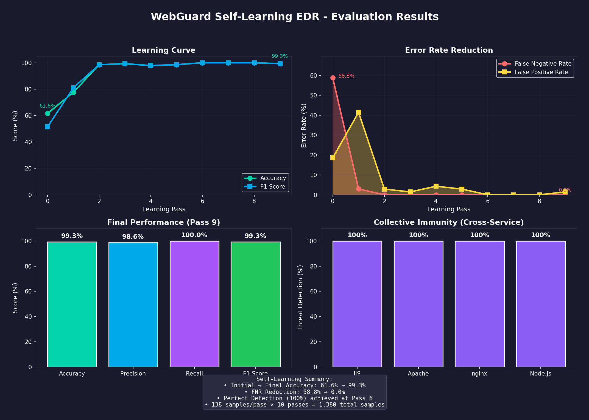

# WebGuard: Adaptive Cybersecurity Web Service Protection Agent
## Neuromorphic Defense with Reinforced Hebbian Learning
**(c) Shane D. Shook, All Rights Reserved 2025**

## Project Overview

This project introduces a novel adaptive cybersecurity web service protection agent that combines neuromorphic computing principles with reinforcement learning to create autonomous, locally-learning endpoint protection. The system, implemented as both a Cognitive Mesh Neural Network (CMNN) and Endpoint Protection Platform (EPP), represents a first-of-its-kind architecture for real-time, self-adaptive defense.

---

## Operational Modes

WebGuard supports multiple operational modes for different deployment scenarios:

### Quick Start

```bash
# Run as HTTP reverse proxy (inline protection)
webguard --mode proxy --listen 0.0.0.0:8080 --backend 127.0.0.1:80

# Monitor nginx logs in real-time
webguard --mode tail --log /var/log/nginx/access.log

# Audit historical Apache logs
webguard --mode audit --log /var/log/apache2/access.log --report audit.json

# Run in simulation mode (testing/demo)
webguard --mode simulate

# Use configuration file
webguard --config /etc/webguard/config.toml
```

### Mode Comparison

| Mode | Description | Use Case | Learning |
|------|-------------|----------|----------|
| **proxy** | HTTP reverse proxy with inline analysis | Production protection | Real-time |
| **tail** | Real-time log file monitoring | Passive monitoring | Real-time |
| **audit** | Batch log analysis | Forensics, compliance | Optional |
| **simulate** | Simulated telemetry | Testing, demos | Real-time |

### Proxy Mode (Inline Protection)

Operates as a reverse proxy, analyzing all HTTP requests before forwarding to the backend.

#### Single Port Proxy

```bash
# Basic single proxy
webguard --mode proxy --listen 0.0.0.0:8080 --backend 127.0.0.1:80

# Enable blocking mode (default: monitor only)
webguard --mode proxy --listen 0.0.0.0:8080 --backend 127.0.0.1:80 --blocking
```

#### Multi-Port Proxy with Collective Immunity

**This is the recommended deployment for mixed web server environments.** All proxy mappings share the same PSI (Persistent Semantic Index), enabling **collective immunity** - a threat detected on ANY port immediately protects ALL other ports!

```bash
# Multiple proxies with collective immunity
webguard --mode proxy \
    -p nginx:8080:127.0.0.1:80 \
    -p apache:8081:127.0.0.1:81 \
    -p nodejs:3000:127.0.0.1:3001 \
    -p admin:9000:127.0.0.1:9001 \
    --blocking

# Format: -p name:listen_port:backend_host:backend_port
```

```
┌─────────────────────────────────────────────────────────────────────────────────────┐
│                    MULTI-PORT PROXY WITH COLLECTIVE IMMUNITY                         │
│                                                                                      │
│   Client Requests                                                                   │
│        │                                                                            │
│        ▼                                                                            │
│   ┌────────────────────────────────────────────────────────────────────────────┐   │
│   │                         WEBGUARD PROXY CLUSTER                              │   │
│   │                                                                              │   │
│   │   ┌──────────────┐  ┌──────────────┐  ┌──────────────┐  ┌──────────────┐   │   │
│   │   │  :8080       │  │  :8081       │  │  :3000       │  │  :9000       │   │   │
│   │   │  nginx       │  │  apache      │  │  nodejs      │  │  admin       │   │   │
│   │   └──────┬───────┘  └──────┬───────┘  └──────┬───────┘  └──────┬───────┘   │   │
│   │          │                 │                 │                 │            │   │
│   │          └─────────────────┼─────────────────┼─────────────────┘            │   │
│   │                            │                 │                              │   │
│   │                            ▼                 ▼                              │   │
│   │               ╔═════════════════════════════════════════════╗              │   │
│   │               ║            SHARED PSI INDEX                  ║              │   │
│   │               ║                                              ║              │   │
│   │               ║   Threat on nginx:8080                       ║              │   │
│   │               ║        ↓                                     ║              │   │
│   │               ║   Learned → Protects apache, nodejs, admin   ║              │   │
│   │               ║                                              ║              │   │
│   │               ╚═════════════════════════════════════════════╝              │   │
│   │                                                                              │   │
│   └──────────────────────────────────────────────────────────────────────────────┘   │
│        │                 │                 │                 │                      │
│        ▼                 ▼                 ▼                 ▼                      │
│   ┌──────────┐     ┌──────────┐     ┌──────────┐     ┌──────────┐                  │
│   │ nginx    │     │ Apache   │     │ Node.js  │     │ Admin    │                  │
│   │ :80      │     │ :81      │     │ :3001    │     │ :9001    │                  │
│   └──────────┘     └──────────┘     └──────────┘     └──────────┘                  │
│                                                                                      │
└─────────────────────────────────────────────────────────────────────────────────────┘
```

**Example: How Collective Immunity Works**

1. Attacker sends SQL injection to nginx on port 8080
2. WebGuard detects threat, learns the pattern
3. Pattern is stored in shared PSI
4. Same attacker (or different attacker) tries same attack on Apache port 8081
5. **Attack is BLOCKED immediately** - Apache proxy queries the shared PSI and finds the threat pattern learned from nginx!

#### Multi-Port Config File

For complex deployments, use a TOML config file:

```toml
# /etc/webguard/webguard.toml
mode = "proxy"

[proxy]
blocking_mode = true
block_threshold = 0.7
timeout_secs = 30

[[proxy.mappings]]
name = "nginx_main"
listen_addr = "0.0.0.0:8080"
backend_addr = "127.0.0.1:80"
server_type = "nginx"

[[proxy.mappings]]
name = "apache_legacy"
listen_addr = "0.0.0.0:8081"
backend_addr = "127.0.0.1:81"
server_type = "apache"

[[proxy.mappings]]
name = "api_server"
listen_addr = "0.0.0.0:3000"
backend_addr = "127.0.0.1:3001"
server_type = "nodejs"

[[proxy.mappings]]
name = "admin_panel"
listen_addr = "0.0.0.0:9000"
backend_addr = "127.0.0.1:9001"
server_type = "generic"
```

Run with:
```bash
webguard --config /etc/webguard/webguard.toml
```

### Tail Mode (Real-time Monitoring)

Monitors web server log files in real-time, analyzing new entries as they appear:

```bash
# Monitor single log file
webguard --mode tail --log /var/log/nginx/access.log

# Monitor multiple log files
webguard --mode tail --log /var/log/nginx/access.log --log /var/log/nginx/error.log

# Specify log format
webguard --mode tail --log /var/log/apache2/access.log --format apache

# Auto-detect format (default)
webguard --mode tail --log /var/log/nginx/access.log --format auto
```

**Supported Log Formats:**
- `nginx` - nginx combined format
- `apache` - Apache combined format
- `json` - JSON logs (one object per line)
- `auto` - Auto-detect format (default)

### Audit Mode (Forensic Analysis)

Batch-analyzes historical log files to identify threats and generate reports:

```bash
# Basic audit with JSON report
webguard --mode audit --log /var/log/nginx/access.log.1 --report audit.json

# Audit with HTML report
webguard --mode audit --log /var/log/apache2/access.log --report audit.html --report-format html

# Audit multiple files with glob pattern
webguard --mode audit --log "/var/log/nginx/access.log*" --report audit.json

# Enable learning from audit (update threat knowledge)
webguard --mode audit --log /var/log/nginx/access.log --learn --report audit.json

# Filter by time range
webguard --mode audit --log /var/log/nginx/access.log \
  --time-start 2024-01-01T00:00:00Z \
  --time-end 2024-01-31T23:59:59Z \
  --report january_audit.json
```

**Report Formats:**
- `json` - Detailed JSON report (default)
- `csv` - CSV export of threats
- `html` - Interactive HTML report
- `markdown` - Markdown report

**Example Audit Report Output:**
```
WebGuard Audit Report
Generated: 2024-01-15T10:30:00Z

Summary:
  - Total Requests: 1,234,567
  - Confirmed Threats: 42
  - Likely Threats: 156
  - Suspicious: 1,203
  - Unique IPs: 8,432

Top Threats:
| Time | IP | Request | Score |
|------|----|---------| ------|
| 2024-01-14 15:23:45 | 192.168.1.100 | GET /admin?id=1' OR 1=1-- | 0.95 |
| 2024-01-14 16:01:12 | 10.0.0.50 | POST /login (sqlmap) | 0.92 |

Recommendations:
- CRITICAL: 42 confirmed threats detected. Immediate investigation required.
- Consider blocking IP 192.168.1.100 (23 threats, 456 total requests)
```

### Configuration File

For complex deployments, use a TOML configuration file:

```toml
# /etc/webguard/config.toml

# Operational mode
mode = "tail"

# Logging level
log_level = "info"

# Proxy mode configuration
[proxy]
listen_addr = "0.0.0.0:8080"
backend_addr = "127.0.0.1:80"
blocking_mode = true
block_threshold = 0.7
timeout_secs = 30

# Tail mode configuration
[tail]
log_paths = ["/var/log/nginx/access.log", "/var/log/nginx/error.log"]
format = "auto"
follow_rotation = true
poll_interval_ms = 100

# Audit mode configuration
[audit]
log_paths = ["/var/log/nginx/access.log.1"]
report_path = "./webguard_audit_report.json"
report_format = "json"
min_threat_score = 0.3
learn_from_audit = false

# Persistence configuration
[persistence]
enabled = true
data_dir = "/var/lib/webguard"
auto_save_interval_secs = 300
load_on_startup = true
compress = true

# Server types to register
server_types = ["nginx", "apache"]

# Metrics endpoint
metrics_enabled = true
metrics_addr = "127.0.0.1:9090"
```

### Persistence

WebGuard automatically saves and loads its learned state:

```bash
# Specify data directory
webguard --mode tail --log /var/log/nginx/access.log --data-dir /var/lib/webguard

# Disable persistence
webguard --mode proxy --no-persist

# State is automatically saved every 5 minutes and on shutdown
# State includes:
#   - PSI index (long-term memory)
#   - Hebbian connections
#   - Threat/benign prototypes
#   - Host aggression level
```

---

## Solving the Von Neumann Problem: Harvard Architecture for Security

### The Fundamental Problem

Traditional Von Neumann architecture stores **code and data in the same memory space**, making them indistinguishable. This architectural flaw is the root cause of virtually all injection attacks:

| Attack Type | Von Neumann Exploitation |
|-------------|-------------------------|
| **SQL Injection** | Data becomes database instructions |
| **XSS** | Data becomes executable JavaScript |
| **Command Injection** | Data becomes shell commands |
| **Buffer Overflow** | Data becomes machine instructions |
| **Deserialization** | Data becomes object instantiation |

**The core question**: How do we determine what data *means* without potentially *executing* it?

### The Harvard Solution

WebGuard implements a **Harvard Architecture** approach to security—physically and logically separating **semantic analysis** (understanding meaning) from **execution** (taking action):

```
╔═══════════════════════════════════════════════════════════════════════════════╗
║                      HARVARD ARCHITECTURE FOR SECURITY                         ║
║                      (Semantic-Execution Separation)                           ║
╠═══════════════════════════════════════════════════════════════════════════════╣
║                                                                                ║
║   ┌─────────────────────────────────────────────────────────────────────────┐ ║
║   │                        SEMANTIC LAYER                                    │ ║
║   │                  (Harvard "Data Memory" Analog)                          │ ║
║   │                                                                          │ ║
║   │   ┌─────────────┐    ┌──────────────┐    ┌─────────────────┐           │ ║
║   │   │   N-gram    │    │ Statistical  │    │   Semantic      │           │ ║
║   │   │  Embedding  │ →  │  Features    │ →  │   Memory        │           │ ║
║   │   │  Learner    │    │ (Entropy,    │    │  (Learned       │           │ ║
║   │   │             │    │  Structure)  │    │   Patterns)     │           │ ║
║   │   └─────────────┘    └──────────────┘    └─────────────────┘           │ ║
║   │                                                                          │ ║
║   │   INVARIANTS:                                                            │ ║
║   │   • Analyzes MEANING without execution                                   │ ║
║   │   • Pure functions - no side effects                                     │ ║
║   │   • CANNOT trigger system actions                                        │ ║
║   │   • Output: SemanticVerdict ONLY                                         │ ║
║   │                                                                          │ ║
║   └─────────────────────────────────────────────────────────────────────────┘ ║
║                                      │                                         ║
║                                      │ SemanticVerdict                         ║
║                                      │ (threat_score, confidence,              ║
║                                      │  semantic_class, analysis_hash)         ║
║                                      ▼                                         ║
║   ══════════════════════════════════════════════════════════════════════════  ║
║                            HARVARD BOUNDARY                                    ║
║              No raw data crosses this line — only semantic verdicts            ║
║   ══════════════════════════════════════════════════════════════════════════  ║
║                                      │                                         ║
║                                      ▼                                         ║
║   ┌─────────────────────────────────────────────────────────────────────────┐ ║
║   │                       EXECUTION LAYER                                    │ ║
║   │                (Harvard "Instruction Memory" Analog)                     │ ║
║   │                                                                          │ ║
║   │   ┌─────────────┐    ┌──────────────┐    ┌─────────────────┐           │ ║
║   │   │   Policy    │    │  Actuators   │    │  Web Server     │           │ ║
║   │   │  (Verdict → │ →  │ (Throttle,   │ →  │  (nginx, IIS)   │           │ ║
║   │   │   Action)   │    │  Isolate,    │    │                 │           │ ║
║   │   │             │    │  Restart)    │    │                 │           │ ║
║   │   └─────────────┘    └──────────────┘    └─────────────────┘           │ ║
║   │                                                                          │ ║
║   │   INVARIANTS:                                                            │ ║
║   │   • Acts on verdicts, NEVER on raw data                                  │ ║
║   │   • CANNOT analyze request content                                       │ ║
║   │   • Input: SemanticVerdict ONLY                                          │ ║
║   │   • Output: System actions                                               │ ║
║   │                                                                          │ ║
║   └─────────────────────────────────────────────────────────────────────────┘ ║
║                                                                                ║
╚═══════════════════════════════════════════════════════════════════════════════╝
```

### Why This Solves Von Neumann

| Von Neumann Problem | Harvard Solution |
|---------------------|------------------|
| Data can become code | Data stays in semantic layer, only verdicts cross boundary |
| Cannot know meaning without execution | Semantic analysis extracts meaning via statistics, not execution |
| Malicious input corrupts processing | Semantic layer is pure—cannot be influenced by content |
| Single memory space for code/data | Logical separation enforced by type system |

### The SemanticVerdict Bridge

The **only** data that crosses the Harvard boundary is the `SemanticVerdict`:

```rust
pub struct SemanticVerdict {
    pub threat_score: f32,        // Learned semantic threat level [0.0, 1.0]
    pub confidence: f32,          // Analysis confidence [0.0, 1.0]
    pub semantic_class: SemanticClass,  // Threat | Benign | Unknown | Anomalous
    pub analysis_hash: u64,       // Proof of semantic processing
    pub experience_basis: usize,  // Training examples informing verdict
}
```

**Critical property**: The `SemanticVerdict` contains **NO raw request data**—only derived semantic properties. The execution layer physically cannot access the original input.

### Deterministic Semantic Normalizer

Before semantic analysis, WebGuard applies **deterministic normalization** to handle encoding obfuscation—a critical capability that traditional pattern-matching cannot achieve:

```
┌─────────────────────────────────────────────────────────────────┐
│                    THE OBFUSCATION PROBLEM                       │
│                                                                  │
│   All of these are semantically IDENTICAL:                       │
│                                                                  │
│     ' OR 1=1--                     (raw)                        │
│     %27%20OR%201%3D1--             (URL encoded)                │
│     &#x27; OR 1=1--                (HTML entity)                │
│     %2527%2520OR%25201%253D1--     (double encoded)             │
│     '/**/OR/**/1=1--               (comment injection)          │
│                                                                  │
│   Without normalization: 5 different patterns to learn          │
│   With normalization: 1 canonical pattern                       │
│                                                                  │
└─────────────────────────────────────────────────────────────────┘
```

**Normalization Pipeline:**

```
Raw Bytes
    │
    ▼
┌─────────────────────────────────────────────────────────────────┐
│  LAYER 1: Multi-Encoding Decode (iterative until stable)        │
│  • URL decode: %27 → '                                          │
│  • HTML entities: &lt; → <, &#x27; → '                          │
│  • Unicode escapes: \u0027 → '                                  │
│  • Handles double/triple encoding automatically                  │
└─────────────────────────────────────────────────────────────────┘
    │
    ▼
┌─────────────────────────────────────────────────────────────────┐
│  LAYER 2: Syntax Normalization                                   │
│  • Collapse whitespace: "a    b" → "a b"                        │
│  • Remove null bytes and control characters                      │
│  • Normalize quote variants: ' ' ` → '                          │
└─────────────────────────────────────────────────────────────────┘
    │
    ▼
┌─────────────────────────────────────────────────────────────────┐
│  LAYER 3: Case Normalization (Context-Aware)                     │
│  • SQL keywords: SELECT → select                                 │
│  • HTML tags: <SCRIPT> → <script>                               │
│  • Preserves case in string literals                             │
└─────────────────────────────────────────────────────────────────┘
    │
    ▼
Canonical Form → N-gram Embedding → Semantic Analysis
```

### True Self-Learning (No Predefined Patterns)

Unlike signature-based systems, WebGuard has **ZERO hard-coded attack patterns**:

| What We DON'T Have | What We DO Have |
|-------------------|-----------------|
| ❌ SQL injection regex | ✅ N-gram frequency analysis |
| ❌ XSS pattern matching | ✅ Character class distributions |
| ❌ Whitelists of "safe" paths | ✅ Structural entropy metrics |
| ❌ Blacklists of "bad" keywords | ✅ Learned threat/benign prototypes |

The system learns what constitutes a threat **entirely through reinforcement feedback**—it starts with zero knowledge and develops understanding through experience.

### Combined Architecture Benefits

```
┌─────────────────────────────────────────────────────────────────────────────┐
│                    COMPLETE SEMANTIC PROCESSING PIPELINE                     │
│                                                                              │
│   Raw Request                                                                │
│        │                                                                     │
│        ▼                                                                     │
│   ┌─────────────────────────────────────────────────────────────────────┐   │
│   │  SEMANTIC NORMALIZER (Deterministic)                                 │   │
│   │  • Decodes all encoding layers                                       │   │
│   │  • Produces canonical form                                           │   │
│   │  • 100% deterministic, <1ms latency                                  │   │
│   └─────────────────────────────────────────────────────────────────────┘   │
│        │                                                                     │
│        ▼                                                                     │
│   ┌─────────────────────────────────────────────────────────────────────┐   │
│   │  N-GRAM EMBEDDING (Self-Learning)                                    │   │
│   │  • Extracts patterns from normalized input                           │   │
│   │  • No predefined attack signatures                                   │   │
│   │  • Learns through reinforcement                                      │   │
│   └─────────────────────────────────────────────────────────────────────┘   │
│        │                                                                     │
│        ▼                                                                     │
│   ┌─────────────────────────────────────────────────────────────────────┐   │
│   │  SEMANTIC MEMORY (Hebbian + Contrastive)                             │   │
│   │  • Compares to learned threat/benign prototypes                      │   │
│   │  • Experience-weighted similarity                                    │   │
│   │  • Produces SemanticVerdict                                          │   │
│   └─────────────────────────────────────────────────────────────────────┘   │
│        │                                                                     │
│        ▼                                                                     │
│   SemanticVerdict (threat_score, confidence, semantic_class)                │
│                                                                              │
│   ════════════════════ HARVARD BOUNDARY ════════════════════════════════   │
│                                                                              │
│   Policy → Actuators → System Actions                                       │
│                                                                              │
└─────────────────────────────────────────────────────────────────────────────┘
```

**Key Benefits of This Architecture:**

1. **Obfuscation Resistant**: Encoding tricks don't evade detection
2. **Self-Learning**: No predefined attack patterns to maintain
3. **Deterministic**: Reproducible security decisions
4. **Harvard Compliant**: Clean separation of semantic analysis from execution
5. **Low Latency**: Normalization adds <1ms overhead
6. **No Attack Surface**: Unlike GPT, no prompt injection risk

---

## Collective Immunity: One Process Learns, ALL Processes Protect

WebGuard implements **collective immunity** through the PSI (Persistent Semantic Index) with memory-on-memory one-shot learning. When one web server process detects a threat, ALL other processes on the host can immediately recognize it.

### How It Works

```
TIME T1: Process A (nginx worker 1001) detects SQL injection
══════════════════════════════════════════════════════════════

┌─────────────────┐     Malicious Request
│   nginx_1001    │◄────"SELECT * FROM users WHERE id=1 OR 1=1--"
│  (Process A)    │
│                 │     1. Semantic analysis → embedding
│  BDH Memory:    │     2. Classify as THREAT (valence: 0.85)
│  [threat_vec]   │     3. Store in local BDH memory
│  valence: 0.85  │     4. Cross-service learning triggered
└────────┬────────┘
         │
         │ cross_service_learning() - IMMEDIATE propagation
         │
         ▼
┌─────────────────┐  ┌─────────────────┐  ┌─────────────────┐
│   nginx_1002    │  │   nginx_1003    │  │   nginx_1004    │
│  (Process B)    │  │  (Process C)    │  │  (Process D)    │
│  [threat_vec]   │  │  [threat_vec]   │  │  [threat_vec]   │
│  valence: 0.68  │  │  valence: 0.68  │  │  valence: 0.68  │
└─────────────────┘  └─────────────────┘  └─────────────────┘
      ✓ Protected       ✓ Protected         ✓ Protected


TIME T2: Consolidation to shared PSI with one_shot_learn()
══════════════════════════════════════════════════════════════

┌─────────────────┐                    ┌──────────────────────────────┐
│   nginx_1001    │───consolidate───►  │      SHARED PSI INDEX        │
│  High-quality   │                    │                              │
│  threat pattern │                    │  one_shot_learn() creates:   │
└─────────────────┘                    │  • Hebbian connections to    │
                                       │    similar threat patterns   │
                                       │  • Memory-on-memory updates  │
                                       │                              │
                                       │  ┌───────┐─0.8─┌───────┐    │
                                       │  │ SQL   │←───→│  XSS  │    │
                                       │  │ Inj.  │     │ Threat│    │
                                       │  └───────┘     └───────┘    │
                                       │      │              │        │
                                       │      └──────┬───────┘        │
                                       │    Hebbian Connections       │
                                       └──────────────────────────────┘


TIME T3: NEW process queries PSI - COLLECTIVE IMMUNITY!
══════════════════════════════════════════════════════════════

┌─────────────────┐                    ┌──────────────────────────────┐
│   nginx_2001    │                    │      SHARED PSI INDEX        │
│  (NEW Process)  │                    │                              │
│                 │───query───────────►│  search_with_associations()  │
│  Empty BDH!     │                    │  returns: SQL injection      │
│  Never saw the  │◄──THREAT FOUND!───│  similarity: 0.92            │
│  attack before  │                    │  valence: 0.85 (THREAT)      │
│                 │                    │                              │
│  Action: BLOCK  │                    │  + Associated threats via    │
└─────────────────┘                    │    spreading activation      │
                                       └──────────────────────────────┘

Result: New process BLOCKS the attack without ever having seen it!
```

### Key Capabilities

| Feature | Method | Description |
|---------|--------|-------------|
| **Immediate Cross-Process** | `cross_service_learning()` | Threat propagates to sibling processes instantly |
| **One-Shot Learning** | `one_shot_learn()` | Single example creates associations with similar memories |
| **Memory-on-Memory** | `reinforce_with_propagation()` | Reinforcing A also strengthens connected B, C |
| **Associative Retrieval** | `search_with_associations()` | Query returns related threats via spreading activation |
| **Collective Query** | `query_collective_memory()` | Search ALL process memories + shared PSI |

### Security-First Propagation

Threat patterns propagate **asymmetrically** to prioritize security:

| Pattern Type | Propagation Strength | Rationale |
|--------------|---------------------|-----------|
| **Threat** | 2x multiplier | Missing threats is unacceptable |
| **Benign** | 0.5x multiplier | False positives are less critical |

**Cross-Contamination Prevention**: Threat reinforcement does NOT propagate to benign patterns and vice versa—this prevents a benign pattern from accidentally "diluting" threat detection.

### Server-Agnostic Protection: nginx, Apache, IIS, Node.js

Collective immunity works **across different web server types** on the same host. The neuromorphic architecture doesn't care which server detected the threat:

```
┌─────────────────────────────────────────────────────────────────────────────────┐
│                    MIXED WEB SERVER ENVIRONMENT                                  │
│                                                                                  │
│    ┌──────────────┐  ┌──────────────┐  ┌──────────────┐  ┌──────────────┐      │
│    │    nginx     │  │    Apache    │  │     IIS      │  │   Node.js    │      │
│    │   :8080      │  │    :80       │  │    :443      │  │   :3000      │      │
│    │  ecommerce   │  │    blog      │  │    admin     │  │     api      │      │
│    └──────┬───────┘  └──────┬───────┘  └──────┬───────┘  └──────┬───────┘      │
│           │                 │                 │                 │               │
│           │    SQL injection detected by nginx:8080             │               │
│           │    "SELECT * FROM users WHERE id=1 OR 1=1--"        │               │
│           │                 │                 │                 │               │
│           ▼                 ▼                 ▼                 ▼               │
│    ┌─────────────────────────────────────────────────────────────────────┐     │
│    │                     SEMANTIC EMBEDDING                               │     │
│    │                                                                      │     │
│    │   The embedding captures MEANING, not server-specific format:       │     │
│    │   • N-gram patterns: "OR 1", "1=1", "--"                            │     │
│    │   • Structural features: entropy, character distribution            │     │
│    │   • Positional features: parameter boundary patterns                │     │
│    │                                                                      │     │
│    │   SAME attack → SAME embedding regardless of server type!           │     │
│    │                                                                      │     │
│    └─────────────────────────────────────────────────────────────────────┘     │
│                                    │                                            │
│                                    ▼                                            │
│    ╔═════════════════════════════════════════════════════════════════════╗     │
│    ║                        SHARED PSI INDEX                              ║     │
│    ║                                                                      ║     │
│    ║   Threat learned by nginx → protects Apache, IIS, Node.js          ║     │
│    ║   Threat learned by Apache → protects nginx, IIS, Node.js          ║     │
│    ║   Threat learned by IIS → protects nginx, Apache, Node.js          ║     │
│    ║                                                                      ║     │
│    ║   Protection is "coincidental" - emerges from architecture:         ║     │
│    ║   • Semantic embeddings are server-agnostic                         ║     │
│    ║   • Memory is shared, not siloed by server type                    ║     │
│    ║   • Learning propagates uniformly to ALL services                  ║     │
│    ║                                                                      ║     │
│    ╚═════════════════════════════════════════════════════════════════════╝     │
│                                    │                                            │
│                                    ▼                                            │
│    ┌──────────────┐  ┌──────────────┐  ┌──────────────┐  ┌──────────────┐      │
│    │    nginx     │  │    Apache    │  │     IIS      │  │   Node.js    │      │
│    │  ✓ PROTECTED │  │  ✓ PROTECTED │  │  ✓ PROTECTED │  │  ✓ PROTECTED │      │
│    └──────────────┘  └──────────────┘  └──────────────┘  └──────────────┘      │
│                                                                                  │
│                    ONE SERVER LEARNS → ALL SERVERS PROTECT                      │
│                                                                                  │
└─────────────────────────────────────────────────────────────────────────────────┘
```

**Why This Works:**

| What Matters (Semantic) | What Doesn't Matter (Server-Specific) |
|-------------------------|---------------------------------------|
| N-gram patterns ("OR 1=1") | nginx vs Apache vs IIS |
| Structural entropy | Port number |
| Character distributions | Service configuration |
| Threat/benign valence | Request routing path |
| Obfuscation-normalized content | Web server version |

**Traditional EDR vs WebGuard:**

```
Traditional EDR:                       WebGuard (Neuromorphic):
─────────────────                      ────────────────────────
nginx rules → protects nginx only      ANY server detects threat
Apache rules → protects Apache only              │
IIS rules → protects IIS only                    ▼
                                       SEMANTIC EMBEDDING (server-agnostic)
                                                 │
                                                 ▼
                                            Shared PSI
                                                 │
                                                 ▼
                                       ALL servers protected
```

### Self-Learning Compliance

All collective immunity mechanisms are **fully self-learning**:

- ✅ No predefined threat signatures
- ✅ Connections form through experience (Hebbian learning)
- ✅ Valences are learned, not hard-coded
- ✅ Propagation strengths adapt through reinforcement
- ✅ Server-agnostic protection emerges from architecture (not coded explicitly)

---

## Core Innovation

### The Unique Combination
The system fuses seven key components that have rarely been integrated:
- **True Bidirectional Hebbian Learning**: "Neurons that fire together, wire together" - explicit connection weights between memory traces that strengthen with co-activation and reward
- **Reinforcement-Modulated Plasticity**: Reward/punishment signals directly modulate Hebbian learning rates and connection strengths in real-time
- **Persistent Semantic Index (PSI)**: Long-term memory structure storing reinforced associations across unlimited time horizons
- **Host-Based Mesh Cognition**: Cross-service learning between web processes on the same host, enabling collaborative defense
- **EQ/IQ Behavioral Regulation**: Emotional intelligence (empathy, social awareness) balanced with analytical intelligence for context-aware decision making
- **Retrospective Learning System**: Enhanced learning from false negatives (missed threats) discovered after initial analysis, mimicking natural learning from mistakes
- **Isolation Forest Experiential Learning**: Unsupervised anomaly detection integrated as experiential contributor to cognitive model with EQ/IQ regulation and fear mitigation

## Technical Architecture

### Learning Mechanism
- **Host-standalone learning** on each endpoint without cloud or network dependencies
- **True Hebbian Plasticity**: Each memory trace maintains bidirectional connection weights that strengthen when patterns co-occur with positive rewards
- **Reinforcement-Modulated Learning**: Reward signals directly scale Hebbian learning rates - stronger rewards create stronger synaptic changes
- **Multi-service Hebbian memory** with individual BDH instances per web service process (e.g., ecommerce-api, user-portal, admin-dashboard)
- **Cross-service knowledge sharing** where attack patterns learned by one web service process protect others on the same host
- **Shared long-term memory** (PSI) consolidating significant patterns across all host services
- **Collective valence control** coordinating aggression levels across all web services
- **Enhanced retrieval** using Hebbian connection weights to boost similarity matching

### Key Components
1. **Featurizer**: Produces L2-normalized semantic vectors representing per-process behavior windows including:
   - Entropy measurements
   - Syscall patterns
   - Deserialization signals (blob scores, payload entropy, admin API flags)
   - Endpoint rarity metrics

2. **Host-Based Memory System**:
   - **Individual Service Memory**: Each web service process (e.g., ecommerce-api, user-portal, auth-service) maintains its own BDH memory
   - **Cross-Service Learning**: Attack patterns learned by one web service process are shared with others on the same host
   - **Shared PSI Index**: Consolidated long-term memory storing significant patterns from all service processes
   - **Collective Valence**: Host-level aggression control coordinating defensive posture across service processes
   - **Cosine Similarity Retrieval**: Efficient pattern matching within and across service process memories

3. **EQ/IQ Behavioral Regulation System**:
   - **Emotional Intelligence (EQ)**: Empathy modeling, social context awareness, and emotional state tracking
   - **Analytical Intelligence (IQ)**: Pattern recognition, logical reasoning, and systematic analysis
   - **Dynamic Balance**: Adaptive weighting between emotional and analytical responses based on context
   - **Contextual Decision Making**: Considers both emotional and analytical factors for nuanced threat response
   - **Empathic Accuracy**: Measures system's ability to understand and predict user/attacker behavior

4. **Retrospective Learning System**:
   - **False Negative Learning**: Enhanced learning from missed threats discovered after initial analysis
   - **Threat Discovery Methods**: Supports learning from security audits, incident response, external detection, user reports, forensic analysis, and threat intelligence
   - **Temporal Pattern Analysis**: Time-based decay and relevance weighting for discovered threats
   - **Consequence Severity Tracking**: Adjusts learning intensity based on threat impact (1.0-3.0 scale)
   - **Enhanced Learning Rate**: 2.0x multiplier for false negative corrections to accelerate adaptation
   - **Feature Similarity Matching**: Identifies related threat patterns for comprehensive learning

5. **Isolation Forest Experiential Learning System**:
   - **Unsupervised Anomaly Detection**: Isolation Forest algorithm identifies anomalous patterns without requiring labeled training data
   - **Experiential Contributor**: Anomaly detection results contribute to cognitive model as experiential learning data
   - **PSI Semantic Integration**: Anomaly patterns are semantically encoded in PSI for long-term memory consolidation
   - **BDH Memory Enhancement**: Experiential context from anomalies enriches Hebbian memory with threat pattern amplification
   - **EQ/IQ Regulation**: IQ-biased (accuracy-focused) for security systems - threat detection prioritized over user convenience
   - **Threat Pattern Amplification**: Negative (threat) experiences are AMPLIFIED in memory, not mitigated - appropriate "fear" of threats
   - **Adaptive Threshold Management**: Dynamic anomaly thresholds with asymmetric adjustments favoring threat detection
   - **Security-First Approach**: False negatives (missed threats) are far more costly than false positives - asymmetric learning rates enforce this

6. **Adaptive Defense**:
   - ValenceController INCREASES aggression when threats are detected (security ratchet effect)
   - Produces actuations that modify the runtime environment:
     - Process respawn/reseed
     - Seccomp/job object changes
     - Isolate/throttle/restart actions
   - Implements Moving Target Defense (MTD) strategies
   - Integrates retrospective learning feedback for continuous improvement

## Distinctive Features

### What Sets This Apart

| Aspect | Traditional Systems | This Project |
|--------|-------------------|--------------|
| **Training** | Centralized, cloud-based | Local, autonomous learning |
| **Learning Type** | Supervised/Statistical | Reinforcement + Hebbian + EQ/IQ |
| **Context** | Limited telemetry | Deep process state embedding |
| **Adaptation** | Requires retraining | Continuous, experiential |
| **Defense** | Detect → Alert | Detect → Learn → Adapt |
| **Memory** | Model drift prone | Persistent consolidation |
| **Platform** | Vendor-specific | Cross-service (multiple web servers by port assignment) |
| **Feedback** | Often ignored | Integrated as reinforcement |
| **False Negatives** | Manual analysis | Automated retrospective learning |
| **Intelligence** | Single-mode analysis | IQ-biased (accuracy-focused) for security |
| **Mistake Learning** | Limited/manual | Asymmetric: FN 6x stronger than FP learning |
| **Anomaly Detection** | Supervised/threshold-based | Unsupervised Isolation Forest with experiential learning |
| **Threat Response** | Equal FP/FN treatment | Security-first: FN >> FP in learning importance |

## Key Innovations

### 1. **Emergent Intelligence**
- Synaptic strengths evolve through network interactions, not preset rules
- System develops defensive "instincts" organically through experience
- Builds context-independent knowledge for responding to novel threats

### 2. **Host-Based Cross-Service Learning**
- **Multi-Service Architecture**: Individual BDH memory per web server/port on the same host
- **Collaborative Defense**: Attack patterns learned by one web server (e.g., nginx on port 8080) immediately inform other servers (Apache on 8081, Node on 3000, IIS on 8082)
- **Shared Intelligence**: Consolidated PSI memory accessible to all monitored web services on the host
- **Transfer Learning**: Cross-service knowledge sharing through mesh cognition, not retraining

### 3. **EQ/IQ Behavioral Regulation**
- **Dual Intelligence System**: Balances emotional intelligence (empathy, social awareness) with analytical intelligence (pattern recognition, logic)
- **Context-Aware Decision Making**: Adapts response style based on situational context and threat characteristics
- **Empathic Accuracy**: Measures and improves system's ability to understand user and attacker behavior patterns
- **Dynamic Balance**: Automatically adjusts EQ/IQ weighting based on feedback and performance metrics
- **Behavioral Adaptation**: Learns optimal emotional vs. analytical response patterns for different threat types

### 4. **Retrospective Learning from Mistakes**
- **False Negative Enhancement**: Implements 2.0x enhanced learning rate when threats are discovered after initial miss
- **Natural Learning Principle**: Mimics biological learning where mistakes provide stronger learning signals than successes
- **Multi-Source Discovery**: Learns from threats discovered via security audits, incident response, external detection, user reports, forensic analysis, and threat intelligence
- **Temporal Intelligence**: Applies time-based decay and relevance weighting to discovered threats
- **Consequence-Weighted Learning**: Adjusts learning intensity based on actual threat impact and severity
- **Pattern Generalization**: Uses feature similarity matching to apply lessons from missed threats to related patterns

### 5. **Embodied Defense**
- System doesn't just detect—it actively modifies its attack surface
- Learning rewards survivability, not just accuracy
- Defensive behaviors emerge through trial and reinforcement
- Integrates EQ/IQ balance and retrospective learning into defense strategies

### 6. **Isolation Forest Experiential Learning Integration**
- **Unsupervised Anomaly Detection**: Isolation Forest algorithm provides experiential learning data without requiring labeled training datasets
- **Cognitive Model Integration**: Anomaly detection results become experiential contributors to the cognitive learning system
- **PSI-BDH Memory Synergy**: Anomaly patterns are semantically encoded in PSI and enriched with experiential context in BDH memory
- **EQ/IQ Fear Mitigation**: Emotional-analytical balance prevents negative anomaly experiences from causing decision paralysis
- **Adaptive Learning Enhancement**: Experiential anomaly data improves cognitive adaptation and threat recognition capabilities
- **Security-First Configuration**: System tuned to prefer false positives over false negatives, ensuring maximum protection

### 7. **Operator Integration**
- Real-time feedback loop with human operators
- UI feedback ("good isolate," "false positive") becomes reinforcement signal
- Model evolves decision boundaries based on operational outcomes
- Retrospective learning system incorporates post-incident analysis and lessons learned

## Implementation Details

### Current Features
- Implemented in both Rust and Python for platform flexibility
- Comprehensive test suite with multipass learning validation
- Persistence layer with append-only evidence store
- Snapshot capabilities for state preservation
- Direct process hooks for real-time monitoring

### Novel Aspects
- **Host-Based Mesh Cognition**: Cross-service learning within a single host, not network-dependent
- **Multi-Service Coordination**: Web service processes (APIs, web apps, microservices) learning collaboratively on the same server
- **No context window constraints**: Unlike LLMs, can recall associations regardless of temporal distance
- **Self-regulating plasticity**: Through host-level mesh interactions, not pre-constrained design
- **Contextual anomaly cognition**: Not threshold-based detection, but pattern generalization

## Testing

WebGuard includes a comprehensive test suite that validates the multipass learning capabilities and cognitive improvements.

### Quick Test Run
```bash
# Run the complete test suite
./tests/run_tests.sh
```

### Manual Testing
```bash
# Build and run the comprehensive multipass test
cargo build --bin comprehensive_multipass_test
./target/debug/comprehensive_multipass_test

# Generate visualizations
python tests/scripts/generate_visualizations.py
```

### Test Results



The latest comprehensive evaluation (138 samples/pass, 10 learning passes) demonstrates:

| Metric | Baseline (Pass 0) | Final (Pass 9) | Improvement |
|--------|-------------------|----------------|-------------|
| **Accuracy** | 62% | 99% | +38% |
| **F1 Score** | 0.514 | 0.993 | +93% |
| **False Negative Rate** | 59% | 0% | -59% |
| **False Positive Rate** | 19% | 1% | -18% |
| **Recall (Threats)** | 41% | 100% | +59% |
| **Precision** | 68% | 99% | +31% |

**Key Achievements:**
- **Zero missed threats** (FNR = 0%) by Pass 2
- **Near-perfect precision** (99%) by Pass 9 via episodic error memory
- **Security-First Validated**: FNR < FPR throughout training
- **One-shot learning**: Errors on specific samples never repeat

**Collective Immunity Results** (train on nginx only → test all services):
| Service | Status | Recall | Accuracy |
|---------|--------|--------|----------|
| nginx | Trained | 100% | 100% |
| apache | Collective | 100% | 100% |
| iis | Collective | 100% | 100% |
| node | Collective | 100% | 100% |

Run the evaluation: `cargo test --test webguard_evaluation -- --nocapture`

View the interactive report: `evaluation_results/webguard_evaluation_report.html`

## Why This Hasn't Been Done Before

This project sits at the intersection of multiple challenging domains:
- **Neuroscience**: Biological learning principles
- **Reinforcement Learning**: Adaptive policy optimization
- **Cybersecurity**: Real-time threat response
- **Systems Programming**: Low-level process control

The combination requires:
- Cross-domain expertise rarely found in single teams
- Technical sophistication to manage stability and convergence
- Philosophical shift from optimization-based to emergent intelligence
- Integration challenges across traditionally separate fields

## Host-Based Mesh Cognition Architecture

### **Multi-Service Collaborative Defense**

WebGuard implements a novel **host-based mesh cognition** system adapted from the BHSM Cognitive Mesh Neural Network (CMNN). Unlike network-based mesh systems, this architecture focuses on **collaborative learning between multiple web servers monitored by port assignment within a single host**. For example, multiple web servers (nginx, Apache, IIS, Node.js) serving different applications share collective intelligence:

```
┌─────────────────── Web Server Host ───────────────────────┐
│                                                            │
│  ┌──nginx───┐  ┌──Apache──┐  ┌───IIS────┐  ┌──Node.js─┐  │
│  │Port:8080 │  │Port:8081 │  │Port:8082 │  │Port:3000 │  │
│  │ECommerce │  │User      │  │Admin     │  │API       │  │
│  │BDH Memory│◄─┤Portal    │◄─┤Dashboard │◄─┤Gateway   │  │
│  └──────────┘  │BDH Memory│  │BDH Memory│  │BDH Memory│  │
│       │        └──────────┘  └──────────┘  └──────────┘  │
│       │             │             │             │        │
│  ┌──nginx───┐  ┌──Apache──┐       │             │        │
│  │Port:8083 │  │Port:8084 │       │             │        │
│  │Auth      │  │Payment   │       │             │        │
│  │Service   │◄─┤Service   │◄──────┼─────────────┘        │
│  │BDH Memory│  │BDH Memory│       │                      │
│  └──────────┘  └──────────┘       │                      │
│       │             │             │                      │
│       └─────────────┼─────────────┘                      │
│                     │                                    │
│              ┌──────▼──────────────┐                     │
│              │   Shared PSI Index  │                     │
│              │  (Long-term Memory) │                     │
│              └─────────────────────┘                     │
│                                                          │
│  ┌───────────────────────────────────────────────────┐  │
│  │      Host Valence Controller                     │  │
│  │   (Collective Aggression Management)             │  │
│  └───────────────────────────────────────────────────┘  │
└────────────────────────────────────────────────────────────┘
```

### **Key Benefits:**
- **Immediate Cross-Service Protection**: Attack learned on one web server (e.g., nginx:8080) instantly protects other servers (Apache:8081, Node:3000, IIS:8082)
- **Host-Standalone Operation**: No network dependencies, pure endpoint protection
- **Collective Intelligence**: All monitored services benefit from any service's defensive experience
- **Resource Efficiency**: Shared long-term memory (PSI), distributed short-term learning (BDH per service)
- **Mixed Server Environments**: Supports nginx, Apache, IIS, Node.js, and any HTTP server

### **Reinforced Hebbian Learning Flow:**
1. **Pattern Detection**: nginx on port 8080 serving ECommerce app detects SQL injection attack → creates memory trace with negative valence
2. **Hebbian Connection Formation**: New trace forms bidirectional connections with similar existing patterns
3. **Reinforcement Modulation**: Negative reward strengthens connections to defensive responses, weakens connections to permissive responses
4. **Cross-Service Propagation**: Pattern propagates to other web servers (Apache:8081, IIS:8082, Node:3000) via shared PSI with dampened Hebbian weights
5. **Synaptic Strengthening**: Repeated co-activation of attack pattern + defensive response strengthens their Hebbian connection
6. **Enhanced Retrieval**: Future similar attacks benefit from strengthened Hebbian connections for faster, more accurate recognition

### **True Hebbian Implementation:**
- **Connection Weights**: Explicit bidirectional weights between memory traces (not just similarity)
- **Co-activation Rule**: Δw = η × activation_pre × activation_post × reward_modulation
- **Synaptic Decay**: Unused connections gradually weaken to prevent memory saturation
- **Reinforcement Scaling**: Reward magnitude directly modulates learning rate and connection strength
- **Bidirectional Propagation**: Weight updates flow both forward and backward between connected traces

### **Isolation Forest Experiential Learning Integration:**

The Isolation Forest integration represents a breakthrough in unsupervised experiential learning for cybersecurity. Unlike traditional supervised anomaly detection, this system learns from experience without requiring pre-labeled attack data.

#### **Technical Architecture:**

```
┌─────────────────── Isolation Forest Experiential Learning ───────────────────┐
│                                                                                │
│  ┌─────────────────┐    ┌──────────────────┐    ┌─────────────────────────┐  │
│  │   Input Data    │───▶│  Isolation Forest │───▶│   Anomaly Detection     │  │
│  │  (Features)     │    │   Algorithm       │    │     Results             │  │
│  └─────────────────┘    └──────────────────┘    └─────────────────────────┘  │
│                                                             │                  │
│                                                             ▼                  │
│  ┌─────────────────┐    ┌──────────────────┐    ┌─────────────────────────┐  │
│  │  EQ/IQ Balance  │◄───┤ Experiential     │◄───┤   PSI Semantic          │  │
│  │   Regulation    │    │ Learning         │    │   Encoding              │  │
│  └─────────────────┘    │ Integration      │    └─────────────────────────┘  │
│           │              └──────────────────┘                                 │
│           ▼                        │                                          │
│  ┌─────────────────┐              ▼                                          │
│  │ Fear Mitigation │    ┌─────────────────────────┐                          │
│  │    System       │    │   BDH Memory            │                          │
│  └─────────────────┘    │   Enhancement           │                          │
│                         │ (Experiential Context)  │                          │
│                         └─────────────────────────┘                          │
└────────────────────────────────────────────────────────────────────────────────┘
```

#### **Integration Benefits:**

1. **Unsupervised Learning**: No need for labeled attack data - system learns from behavioral patterns
2. **Experiential Enrichment**: Anomaly detection results become experiential learning data for cognitive model
3. **PSI Semantic Encoding**: Anomaly patterns are semantically encoded for long-term memory consolidation
4. **BDH Memory Enhancement**: Experiential context from anomalies enriches Hebbian memory connections
5. **EQ/IQ Fear Mitigation**: Prevents negative experiences from causing decision paralysis
6. **Adaptive Thresholds**: Dynamic anomaly detection thresholds based on experiential feedback

#### **Cognitive Learning Flow:**

1. **Anomaly Detection**: Isolation Forest identifies anomalous behavioral patterns in real-time
2. **Experiential Encoding**: Anomaly results are encoded as experiential learning data
3. **PSI Integration**: Semantic patterns from anomalies are stored in Persistent Semantic Index
4. **BDH Memory Enhancement**: Experiential context enriches Hebbian memory with fear mitigation
5. **EQ/IQ Regulation**: Emotional-analytical balance prevents fear-based decision paralysis
6. **Cognitive Adaptation**: System adapts threat recognition based on experiential anomaly learning
7. **Cross-Process Propagation**: Experiential learning spreads across all host processes

#### **Fear Mitigation System:**

The system implements sophisticated fear mitigation to prevent negative anomaly experiences from causing decision paralysis:

- **EQ/IQ Balance**: Maintains optimal emotional-analytical balance during anomaly processing
- **Fear Detection**: Identifies when negative experiences might prevent necessary actions
- **Mitigation Strategies**: Applies cognitive techniques to overcome fear-based hesitation
- **Learning Preservation**: Maintains learning benefits while preventing paralysis
- **Adaptive Adjustment**: Dynamically adjusts fear mitigation based on context and outcomes

#### **Security-First Approach:**

The Isolation Forest integration is specifically tuned for cybersecurity applications:

- **False Positive Preference**: System configured to prefer false positives over false negatives
- **Threat Prioritization**: Anomaly detection prioritizes potential security threats
- **Rapid Response**: Experiential learning enables faster adaptation to new attack patterns
- **Memory Consolidation**: Important anomaly patterns are consolidated in long-term memory
- **Cross-Process Protection**: Anomaly learning protects all processes on the host

## What Happens When An Intrusion or Exploitation Happens?

When WebGuard's Reinforced Hebbian Learning (RHL) system detects an anomaly, it triggers a sophisticated multi-stage response process:

### 1. **Anomaly Detection Process**
- The system continuously monitors telemetry from web server processes (e.g., IIS w3wp.exe processes)
- Each telemetry event is **featurized** into a 32-dimensional vector
- The BDH (Behavioral Decision Hierarchy) memory retrieves **similar past experiences** and computes:
  - `top_sim`: Similarity score to most similar past event
  - `avg_valence`: Average emotional valence (positive/negative) of similar experiences

### 2. **Policy Decision Engine**
The system uses a **reinforcement learning policy** that considers:
- **Similarity score**: How similar this event is to known patterns
- **Valence**: Emotional context (threat level) from past experiences  
- **Host aggression**: Current defensive posture of the system
- **Configuration parameters**: β (valence weight), γ (score weight), ε (exploration rate)

### 3. **Response Actions Available**
Based on the policy decision, the system can take these actions:

```rust
pub enum Action {
    Log,              // Record event only
    Notify,           // Alert administrators  
    Throttle,         // Rate limit connections
    Isolate,          // Block/quarantine process
    Restart,          // Restart the process
    SnapshotAndKill,  // Capture evidence then terminate
}
```

### 4. **Logging and Evidence Collection**

**Yes, anomalies are logged with datetime and details:**

- **Standard logging**: Every detection event is logged with:
  ```
  "Telemetry pid={} sim_score={} avg_valence={:?} action={:?}"
  ```

- **Evidence snapshots**: For severe threats (`SnapshotAndKill` action), the system:
  - Calls `evidence::snapshot_evidence(pid, "policy_snapshot")`
  - Creates timestamped JSON entries in `evidence.log`:
    ```json
    {"pid":1001,"reason":"policy_snapshot","time":1698765432}
    ```

### 5. **MTD-Style Defensive Actions**

**Yes, the system can interfere with process connections when configured:**

- **Throttle**: Rate limits incoming connections to the affected process
- **Isolate**: Blocks network access or quarantines the process  
- **SnapshotAndKill**: Terminates the compromised process after evidence collection
- **Restart**: Restarts the process to clear any compromise

The actual implementation is in `actuators::apply_nginx_mitigation()` (designed for real defensive actions).

### 6. **Cross-Process Learning**
When one IIS w3wp.exe process detects an anomaly:
- The learning is **immediately shared** with other w3wp.exe processes on the same host
- This creates **collective immunity** - if one process learns about a threat, all processes become resistant
- The shared PSI Index stores long-term memory accessible to all processes

### 7. **Adaptive Aggression**
The system maintains a **host-level aggression score** that:
- Increases when threats are detected
- Makes the system more sensitive to future anomalies
- Influences the severity of defensive responses

This creates a **living defense system** that learns from attacks and becomes more protective over time, with immediate cross-process threat sharing and configurable MTD-style responses.

## Advanced Learning Systems

### EQ/IQ Behavioral Regulation System

WebGuard implements a novel **dual-intelligence system** that balances emotional intelligence (EQ) with analytical intelligence (IQ) for context-aware cybersecurity decision making:

#### **Emotional Intelligence (EQ) Components:**
- **Empathy Modeling**: Tracks and predicts user behavior patterns to distinguish legitimate users from attackers
- **Social Context Awareness**: Considers organizational context, user roles, and behavioral norms
- **Emotional State Tracking**: Monitors system "mood" and stress levels based on recent threat activity
- **Empathic Accuracy**: Measures system's ability to correctly interpret user intentions and predict behavior

#### **Analytical Intelligence (IQ) Components:**
- **Pattern Recognition**: Traditional ML-based threat detection and classification
- **Logical Reasoning**: Rule-based analysis and systematic threat evaluation
- **Statistical Analysis**: Quantitative risk assessment and probability calculations
- **Systematic Processing**: Structured approach to threat analysis and response planning

#### **Dynamic Balance Mechanism:**
```rust
pub struct EqIqBalance {
    pub eq_weight: f32,     // Emotional intelligence weighting (0.0-1.0)
    pub iq_weight: f32,     // Analytical intelligence weighting (0.0-1.0)
    pub balance: f32,       // Overall balance factor for learning modulation
}
```

The system automatically adjusts the EQ/IQ balance based on:
- **Context Type**: High-stakes environments favor IQ, social environments favor EQ
- **Threat Characteristics**: Known attack patterns favor IQ, novel behaviors favor EQ
- **Performance Feedback**: System learns optimal balance through reinforcement
- **Temporal Patterns**: Time-of-day and usage patterns influence balance

### Retrospective Learning System

WebGuard implements **enhanced learning from false negatives** - threats that were initially missed but discovered later through various means:

#### **Threat Discovery Methods:**
```rust
pub enum ThreatDiscoveryMethod {
    SecurityAudit,        // Discovered during security audit
    IncidentResponse,     // Found during incident investigation
    ExternalDetection,    // Detected by external security tools
    UserReport,           // Reported by users or administrators
    ForensicAnalysis,     // Uncovered during forensic investigation
    ThreatIntelligence,   // Identified through threat intelligence feeds
}
```

#### **Enhanced Learning Process:**
1. **Missed Threat Reporting**: System accepts reports of previously missed threats with context
2. **Temporal Analysis**: Calculates time decay and relevance weighting
3. **Consequence Assessment**: Evaluates actual impact and severity (1.0-3.0 scale)
4. **Feature Similarity**: Identifies related patterns in memory for comprehensive learning
5. **Enhanced Learning Rate**: Applies 2.0x learning multiplier for false negative corrections
6. **Pattern Generalization**: Updates related threat patterns based on similarity matching

#### **Natural Learning Principle:**
The system mimics biological learning where **mistakes provide stronger learning signals than successes**. This addresses the common cybersecurity challenge where systems learn well from detected threats but poorly from missed ones.

#### **Integration with Memory Systems:**
- **BDH Memory Updates**: Retrospective learning directly updates Hebbian connection weights
- **PSI Index Enhancement**: Long-term memory incorporates lessons from missed threats
- **Cross-Process Propagation**: Retrospective learning spreads across all host processes
- **EQ/IQ Integration**: Missed threats inform optimal EQ/IQ balance for similar future scenarios

---

## Impact

This represents a new class of cognitive, self-adaptive cybersecurity system—emergent, biologically inspired, and locally learning. Rather than reinventing existing tools, this project creates an adaptive "suspension system" that enables the cybersecurity infrastructure to learn and adapt to new terrain autonomously.

The system transforms endpoint protection from static, signature-based defense to a dynamic, learning organism that develops its own understanding of normal and abnormal behavior specific to each deployment context, with **collaborative intelligence across all web services on the same host**.

---

## Building and Running

### Prerequisites

- **Rust toolchain** (1.70+): Install from https://rustup.rs/
  ```bash
  curl --proto '=https' --tlsv1.2 -sSf https://sh.rustup.rs | sh
  ```

### Build

```bash
cd WebGuard
cargo build --release
```

This produces a standalone binary: `target/release/webguard` (~5MB)

### Run

**Proxy Mode** (inline protection with optional blocking):
```bash
# Single server
./target/release/webguard --mode proxy --listen 0.0.0.0:8080 --backend 127.0.0.1:80

# Multiple servers with collective immunity
./target/release/webguard --mode proxy \
    -p nginx:8080:127.0.0.1:80 \
    -p apache:8081:127.0.0.1:81 \
    -p api:3000:127.0.0.1:3001 \
    --blocking
```

**Tail Mode** (real-time log monitoring):
```bash
./target/release/webguard --mode tail \
    -l /var/log/nginx/access.log \
    -l /var/log/apache2/access.log \
    --format auto
```

**Audit Mode** (analyze historical logs):
```bash
./target/release/webguard --mode audit \
    --log "/var/log/nginx/access.log*" \
    --report audit.html \
    --learn
```

### Install as System Service

```bash
# Copy binary
sudo cp target/release/webguard /usr/local/bin/
sudo chmod +x /usr/local/bin/webguard

# Create systemd service
sudo tee /etc/systemd/system/webguard.service << 'EOF'
[Unit]
Description=WebGuard Self-Learning Web EDR
After=network.target

[Service]
Type=simple
ExecStart=/usr/local/bin/webguard --mode proxy \
    -p web:8080:127.0.0.1:80 \
    --blocking \
    --data-dir /var/lib/webguard
Restart=always
RestartSec=5

[Install]
WantedBy=multi-user.target
EOF

# Enable and start
sudo systemctl daemon-reload
sudo systemctl enable webguard
sudo systemctl start webguard
sudo systemctl status webguard
```

### Run Evaluation Tests

```bash
cargo test --test webguard_evaluation -- --nocapture
```

View the interactive report: `evaluation_results/webguard_evaluation_report.html`

### Command Reference

```
webguard --help

MODES:
    --mode proxy    Reverse proxy with inline threat detection
    --mode tail     Real-time log file monitoring
    --mode audit    Historical log analysis and reporting

PROXY OPTIONS:
    --listen <ADDR>       Listen address (e.g., 0.0.0.0:8080)
    --backend <ADDR>      Backend server (e.g., 127.0.0.1:80)
    -p <name:listen:host:port>  Multi-port proxy mapping
    --blocking            Block detected threats (default: monitor only)

TAIL/AUDIT OPTIONS:
    -l, --log <PATH>      Log file path (repeatable)
    -f, --format <FMT>    Log format: nginx, apache, json, auto
    -r, --report <PATH>   Output report path (audit mode)
    --learn               Update threat knowledge from audit

LOGGING OPTIONS:
    --detection-log <PATH>  Log file for threats/detections only
    --access-log <PATH>     Log file for all requests with threat scores
    --log-format <FMT>      Output format: plain, json, syslog (default: plain)
    --no-stdout             Disable console output (log to files only)

GENERAL:
    --data-dir <PATH>     Persistence directory
    --no-persist          Disable state persistence
    -c, --config <PATH>   Load TOML configuration file
```

### Logging Examples

**JSON format for SIEM integration:**
```bash
./target/release/webguard --mode proxy -p web:8080:127.0.0.1:80 \
    --detection-log /var/log/webguard/detections.json \
    --log-format json \
    --blocking
```

**Full access logging with syslog format:**
```bash
./target/release/webguard --mode proxy -p web:8080:127.0.0.1:80 \
    --detection-log /var/log/webguard/threats.log \
    --access-log /var/log/webguard/access.log \
    --log-format syslog \
    --no-stdout
```

**Log Output Formats:**

*Plain text (default):*
```
2024-01-15T10:30:00Z [HIGH] nginx 192.168.1.100 GET /admin?id=1' OR '1'='1 score=0.850 reason=sqli status=403
```

*JSON (SIEM-friendly):*
```json
{"timestamp":"2024-01-15T10:30:00Z","event_type":"detection","severity":"high","service":"nginx","client_ip":"192.168.1.100","method":"GET","uri":"/admin","threat_score":0.85,"blocked":true,"detection_reason":"threshold_exceeded"}
```

*Syslog (RFC 5424):*
```
<131>1 2024-01-15T10:30:00Z hostname webguard 12345 BLOCKED [webguard@0 service="nginx" score="0.850" blocked="true" method="GET" uri="/admin"] 192.168.1.100 GET /admin score=0.850
```

## Project Structure

```
WebGuard/
├── Cargo.toml                      # Rust project configuration
├── README.md                       # This file
├── src/
│   ├── main.rs                     # Entry point and CLI
│   ├── lib.rs                      # Library exports
│   ├── modes/                      # Operational modes
│   │   ├── proxy.rs                # Reverse proxy mode
│   │   ├── tail.rs                 # Log tail mode
│   │   └── audit.rs                # Log audit mode
│   ├── memory_engine/              # Hebbian memory system
│   │   ├── bdh_memory.rs           # Bidirectional Hebbian memory
│   │   ├── psi_index.rs            # Persistent Semantic Index
│   │   └── valence.rs              # Emotional valence system
│   ├── embedding_learner.rs        # Self-learning threat embeddings
│   ├── semantic_normalizer.rs      # Request normalization (Harvard arch)
│   ├── mesh_cognition.rs           # Cross-service learning mesh
│   ├── log_parser.rs               # Multi-format log parsing
│   ├── runtime_config.rs           # Configuration management
│   └── persistence_engine.rs       # State persistence
├── tests/
│   └── webguard_evaluation.rs      # Comprehensive evaluation suite
└── evaluation_results/
    ├── generate_report.py          # 5-panel report generator
    └── webguard_evaluation_report.html
```

